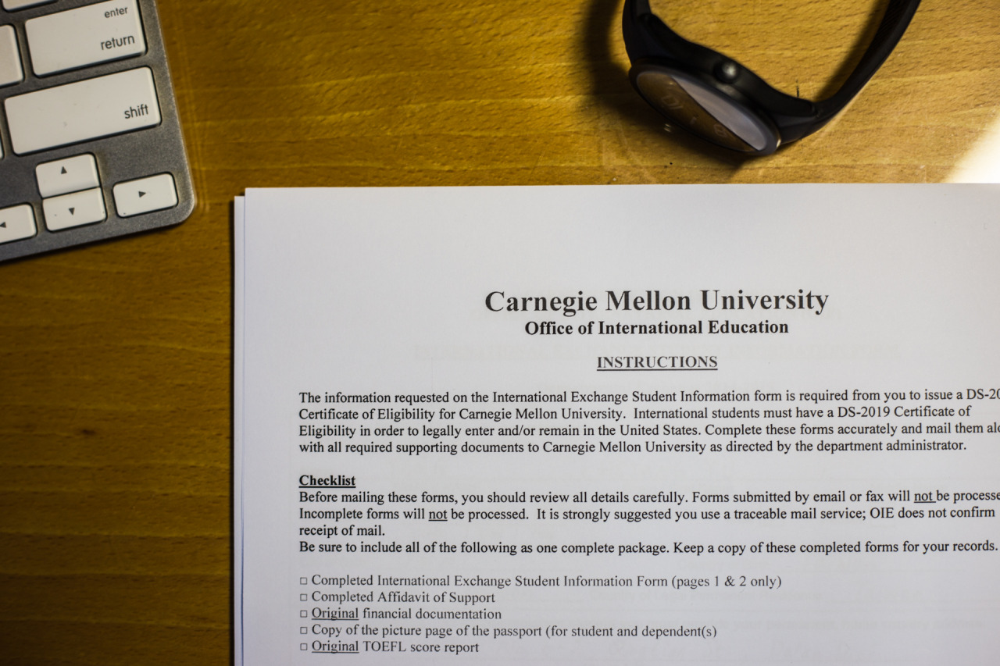

## Let’s Get Started!

"Nice! Let’s get started!" I said to myself when the application instructions finally came into my mailbox.

Students in my college, Nation Chiao Tung University (NCTU), are having quite lots of opportunities to join an exchange program. There are two offices offering exchange programs:

- [Office of International Affairs](http://www.ia.nctu.edu.tw/files/11-1000-130.php): This office offers more than 10 exchange programs to almost every student on campus. You may not get into the school you want if there are too many people trying to apply it, but you still have chances for others. Don't worry you grade too much, just go and ask if any program is suitable for you.
- [ECE Office](http://www.ece.nctu.edu.tw/globalization/index.aspx): This office offers exchange programs only for EE or CS students. Less than 10 colleges are listed, but they are better ones: CMU, UIUC, KOC, etc.

I submitted my applications to both offices, which requires study proposal, “about me”, TOEFL, and few application forms, then got admitted for NTU (Singapore). However, at that time, CMU is more attractive to me. So, I then gave up the chances to NTU, submitted another application to ECE office. This move may be risky if I failed, I will have no place to exchange.

Fortunately, my application was accepted on February. I've been waiting for the next move since then until I received further information from school this week. Nice! Let's get started!

---

*My house @ Taipei, Taiwan. September 28, 2014*
