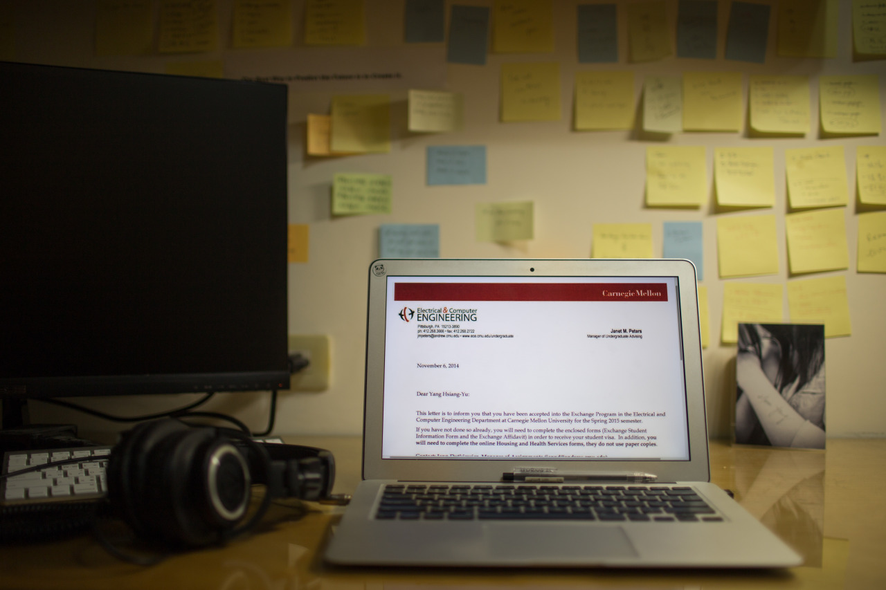

## You Have Been Accepted…

"This letter is to inform you that you have been accepted …" YES! It’s the admission letter from CMU, which popped up in my Inbox app last Friday morning.

I’ve been waiting for this letter for around one year long, and now I can finally relief. In the following Monday, an UPS package containing the J-1 visa arrived my house, which was telling me that I am already on the way to this dream school.

It’s excited to share this happiness with friends on Facebook, and surprisingly found out that I am having a friend, who studied at Stanford with me many years ago, now is living in CMU. In some moments, I can feel that this world is not that big as I image.

Besides being crazy, I started to think what does this trip mean to me. Before departing Taiwan, I would like to write done my goals for this trip:

- Be humble and learn
- Open, and talk with people
- Observe and think

I hope this trip will make me different and be a better man, and I should not forget my initial purposes during the trip. Nice, now is time to read those pages of CMU documents.

---

*My house @ Taipei, Taiwan. November 26, 2014*
