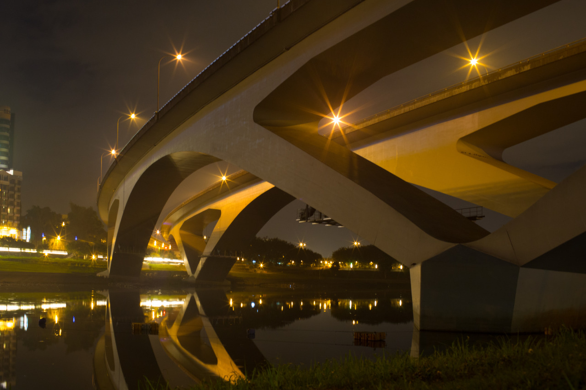

## VISA Application

Getting the exchange student visa, J-1, requires a very complex and long process, which is because that American Government is being super strict on their national security things. Last time I worked on U.S visa application is for the trip to Stanford, and this would be my second time. Here, I am writing down the steps:

- DS-2019: received from the exchange school (CMU) via UPS
- I-901: pay the SEVIS fee for exchange program (visa card acceptable)
- DS-160: fill out a super long form, including education/working experience, previous trips, etc
- MRV fee: pay for the cost of this application process
- Reserve an appointment at AIT
- Go to AIT for the appointment
- Wait for J-1 visa

Since I can only reserve an appointment after the second day of MRRV fee payment, I am now at the step 4. More, J-1 visa is for exchange programs, and F-1, which I used for Stanford summer college, is for general international students. And, J-1 is having more limits than F-1, which only allows me to stay 30 days after it expires.

---

*River Bank @ Xindian, Taiwan. December 6, 2014*
