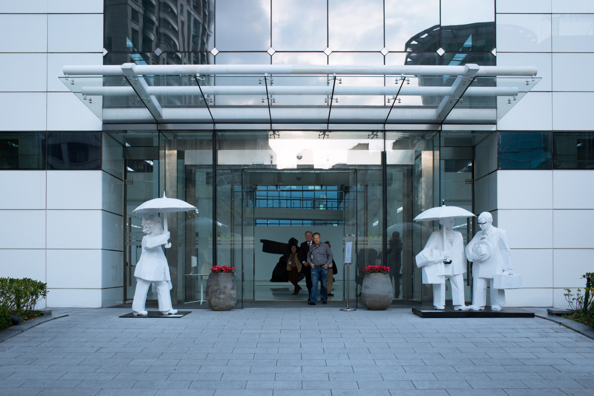

## Leaving from HTC

> Hi All,
>
> Today would be my last day at HTC. I was here as an Summer Intern few months ago, where my HTC journey started. LOTS OF THANKS for every single of you helping/taking care of me during this period, especially my managers, Fen, Owen, and Paul. I really appreciate it. Sadly, it’s time for another journey to go on. I am going to U.S for exchange at CMU. Keep in touch!
>
> Goodbye.
>
> Best,
> Heron

This letter was sent out to the whole team this morning. I am now being thankful for everything happened during this period. This month, it’s a big turning point for me, I am leaving HTC and will leave my college soon, then fly to the other side of earth. I understand that this move is exciting but also changeling. Again, I should stay open and be humble in every following journeys.

The photo was token by me at the HTC headquarter when I was about to leave the company. Surprisedly, when I reviewed the photos, I found  that Peter Chou (CEO) and Cher Wang (Chairman) popped into my photo just in the right timing.

---

*HTC Headquarter @ Xindian, Taiwan. December 6, 2014*
