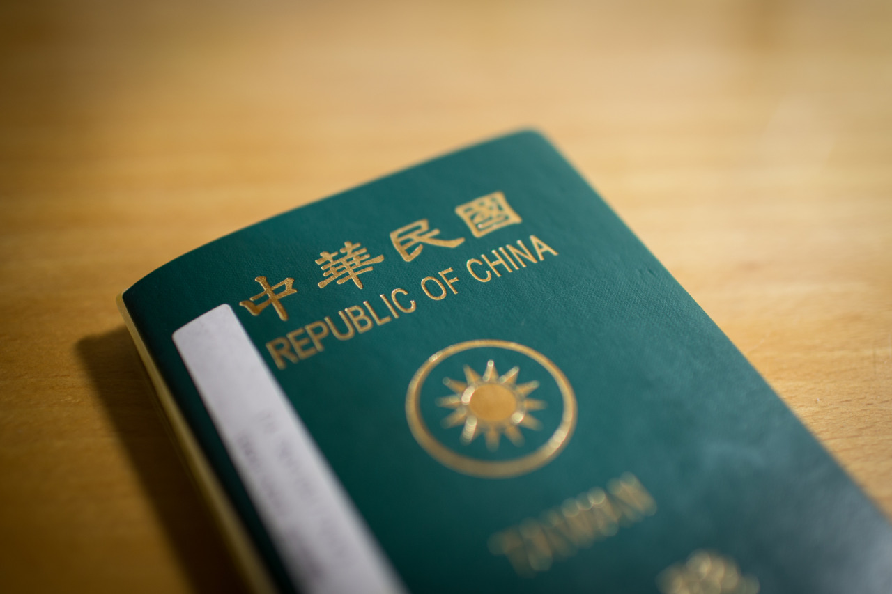

## "OK, you’re all set!"

After submitting tons of complicated documents, the visa appointment at AIT is finally hold this morning. To avoid being rejected, I have to make sure all to documents are well prepared for this appointment. They are:

- Appointment Reservation Sheet: this is the pass ticket for you to enter AIT
- DS-2019: the form from CMU
- DS-160: the confirmation page to support that you’ve submitted the super long form online
- SEVIS Fee Receipt: make sure that you’ve paid the fee for their national exchange program
- Passports: if you’ve visited US before, the old passport will also be required

Actually, there are still other optional documents may be needed, like: admission letter, financial statement from bank, etc. However, in my case, I am fine with the basic required documents.

This is my second time visiting AIT, and last time was for Stanford’s F-1 visa. To successfully receive the visa in the end, one has to go through following steps in AIT:

- Security Guard: with the Appointment Reservation Sheet, he or she will let you in.
- Baggage: no electronic device is allowed in AIT building, so leave your phones or music players here and get a number ticket.
- Document Preparation: he or she will help you review all the documents you need, and put them in the right order. If you haven’t had a correct printed photo, he or she will tell you where you can get one.
- Main Part
    - Document Insertion: hand he or she your documents, and that’s all, you data will be inserted into their system.
    - Fingerprint: fingerprints for all your ten fingers are required, so you have to do the scanning for three times: 4 fingers of left hand, 4 fingers of right hand, and the thumbs.
    - Interview: it’s an interesting part of the whole procedure, and the common questions are “what will you do in the U.S?”, “is this your first time visiting the U.S?“
- Baggage Again: yes, get your phones or other electronic devices back, and ask any question if you want here.

During my interview, the officer is caring about who’s paying my study in US. I told him it’s paid by my parent, and I am also receiving scholarship as well. It seems that it’s much easier for him if my study is sponsored by government scholarship, which means you have less possibility to something illegal. Finally, “OK, you’re all set!” he said to me.

Besides the complicated and tiring procedure, there was one short and cute incident. A girl, who looks like a middle school ABC, lining behind me before the document review. Suddenly, I heard "Oh\~\~\~O" from her, and it seems that she forgot to bring some important documents, and have to leave directly. This application procedure is complicated enough for younger kids to make it right in every detail, and it’s always clever to review more times before doing anything.

---

*My house @ Taipei, Taiwan. December 8, 2014*
