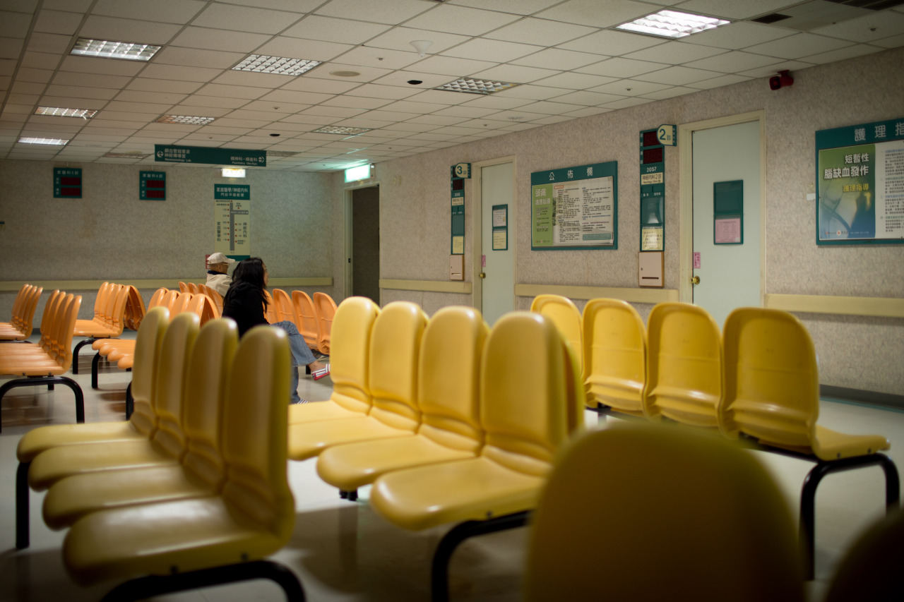

## Immunization

I know that receiving immunizations is required for visiting Afica, but it’s my first time to learn that I have to do it even for studying in America. To live on campus, there are two things I have to finish, one is housing application, another is to fill out the health related forms. Yes, in order to answer every question on the form, few immunizations I have to receive these days before my departure.

Followings are the required immunizations:

- Measles, mumps and rubella (MMR): as a Taiwanese, we had received MMR when we were little, and the exact date can be checked on the old document sheet
- Hepatitis B: this should be received when we were born
- Meningitis: I have never received this before, so here’s my first dose
- Tuberculosis screening (within 6 months): same, I should receive this, and it’s my second dose
Receiving “Tuberculosis screening” is taking longer time since it requires the doctor to diagnose the result 3 days after. However, all of these are finally done today, it had taken more than one week in total.

Actually, it’s been a long time since my last time to be in the hospital. I found it’s pretty different from my daily environments, most of the people are elders, and some look weak. Then, I realised that I am really lucky enough to be healthy and have a chance to explore the world. We should always treasure every moment we have, try to take every challenge we face, and never regret that everything is too late when we are old.

---

*Hospital @ Taipei, Taiwan. December 16, 2014*
