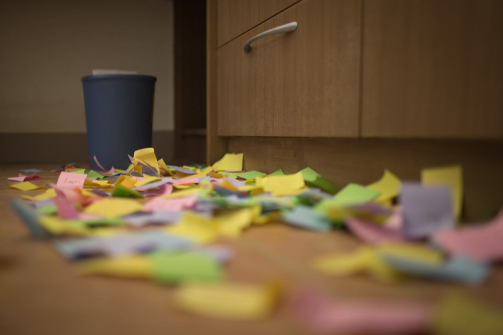

## Moving Out

Finally, it’s time to move out my house in Hsinchu since its contract ends on Jan 1st. And, this time, there’s no coming back in the plan.

I’ve been living here for one and half year. It’s a great place for study and coffees. Lots of friends had visited here, where I can still recall every moments we had. I decorate each walls with different designs. One is full of photos, one is for my project posters, and still another is for Post-its. I’ve been using Post-its for listing my todos, my plans for next hour or the plans for projects. However, I don't throw away the used ones, but stick them on the wall for decoration instead since it’s quite colorful.

“All the things you can’t take away when you move are called ‘garbage’.” I realized the meaning of this sentence when moving from one place to another. So, it’s convinced that we should try to stay cool and not to reluctant the memories. Yes, it’s time for me to move on, and I just removed all the Post-its from the wall which record all the things I’ve done within past one and half years. I feel a little sorrow, but I understand this is just a small challenge for the whole life journey. I really appreciate everything happened in Hsinchu, and all the friends I met here. As always, not much time we have, but too many things have to be done.

---

*My house @ Hsinchu, Taiwan. December 30, 2014*
