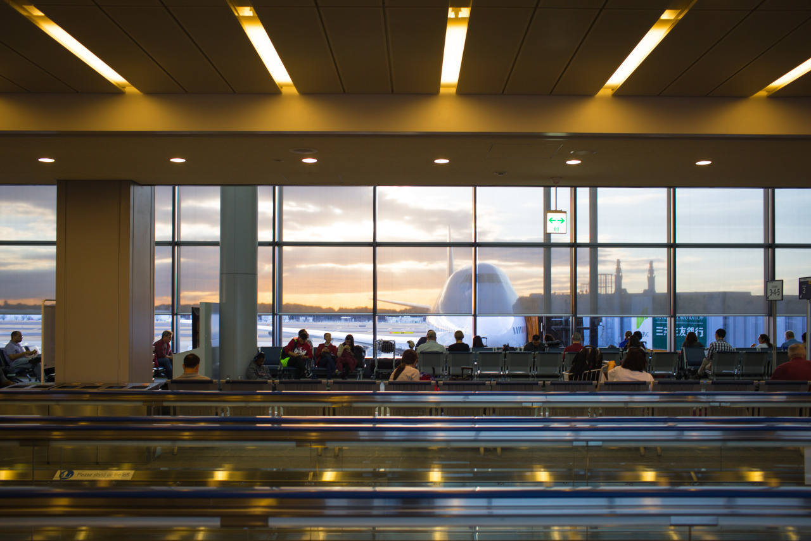

## Tokyo - Simple and Clean

I love Japanese airports, which embraces simplicity and cleanness. This is the fifth time for me to be in Japan, but first time for transferring only. In the airport, the signs are helpful and allows me to find my gate without any problem. Also, there are quite a lot places for phone/laptop charging, and Wifi access is free with nice signal strength.

It toke around 3 hours from Taoyuan to here, which is pretty short period of time. After the flight is taken off, one meal is delivered, and it should be the time to land. Traveling between Taiwan and Japan is also relatively cheap, and I would like to have a small trip in Japan after this.

Most Japanese people I met are nice, even they don’t have a good English pronunciation, they try their best to convey the message. I also enjoy the time chatting with Japaneses. I hope I can stay longer next time, and have a small adventure in this country.

My flight arrived at Narita Airport at 1310 today, and next flight to Chicago will depart at 1740, which will a long flight. I can’t wait the arrival in United State.

---

*Narita Airport @ Tokyo, Japan. January 7, 2015*
