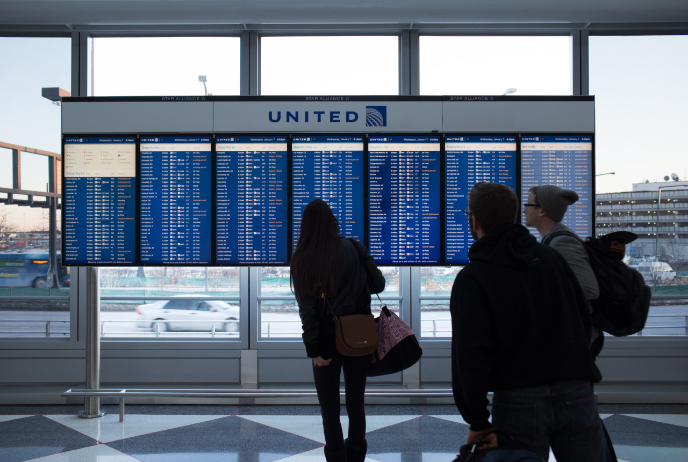

## Connecting Flights

When visiting a far place which the start point and the end point aren't big ones, we should take several transfer flights. However, I found that is called "Connecting Flight" on airport signs instead of "transfer flights" or "transits". This time, I am departing from Taipei, and take connecting flights at Tokyo and Chicago, then finally arrive Pittsburgh.

Now, I am setting in front of the gate in Chicago airport and ready to take my last connecting flight. Here, I am recalling the procedures I've gone through in Tokyo and Chicago:

- **Tokyo**: after landing, you can see two routes when you walk down the plane. One is for entering Japan, another is for taking connecting flights. I took the second, and there will be a luggage screen check. After the check, you are able to find the gate for your next flight! Remember, there's no need to pick up your checked luggage.
- **Chicago**: this is more complex, one should line up for the immigration interview first, then pick up the checked luggage (it may wait for a little long time). And, there’s an airline luggage checking center right after you walk out the luggage pickup place, one can simply hand the luggage to them without any other document checking. Then, leave terminal 5 to terminal 1 for national airline by taking an airport train. There’s one luggage security check before you find your gate for the last flight. However, after this check, all you have to do is sit down and wait, like what I am doing now.

I am taking United Airline, and 3 boarding tickets are received at Taiwan. What I wrote may be different if taking different airlines.

---

*Gate B20, Terminal 1, Chicago Aiport @ Chicago. January 7, 2015*
