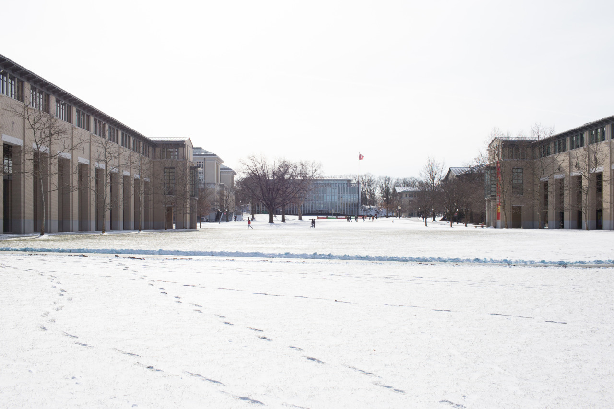

## Nothing but Snow

Finally, I arrived Pittsburgh safely, and settled down most of the things for livings. Yesterday was my first day at Pittsburgh. I met with my roommate Henry at airport, and with great thanks to Mr. Right, we arrived our department with no problem. Mr. Right also brought us to Target, a big retail store, and took us to McDonald for dinner.

Today, we went to PNC bank for having a new bank account, which may send us a debit card next week. Then, we walked to AT&T store for buying a prepaid card for Henry. Carry on, we headed to campus to get our student ID cards, bought linens at bookstore, and do photocopies for tomorrow’s orientation at library. Last, we took a bus to Target again for buying almost everything we need for our room, which includes  tablewares, cooking equipments, drinks, food, etc.

Everything goes pretty well so far, and I am glad to meet my roommate who is from Hong Kong since we share lots of same living habits. We can talk both in English and Chinese, which is fun. The most unforgettable thing is not the view or places we've been to today, but the temperature here. It’s super cold outdoor, so it’s quite hard to stay too long outside. So I found it’s reasonable that Prof. Wu, an NCTU professor who studied at CMU before, told me to check if my nose and hears if they are still there frequently.

---

*CMU Campus @ Pittsburgh. January 8, 2015*
