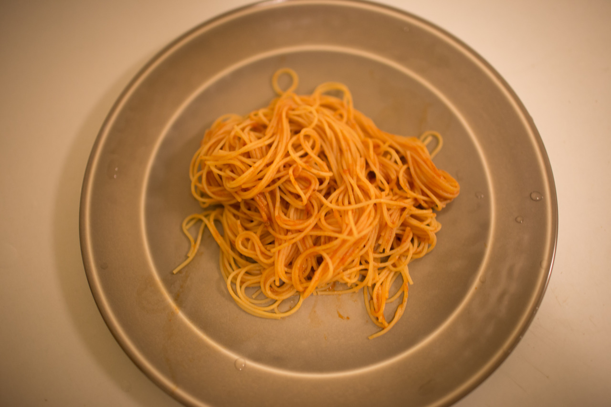

## Power of Survival

Yes, it’s not that hard but fun. Henry and I went to Target today, and we brought a saucepan, plates, tablewares, a roll of foil, noodles, pasta sauces, etc. Funny enough, we spent like two hours to figure out how the oven works, and another two hours to worry that if we can survive here our not by sitting beside the window and watch the snow on the street. However, because of our power of survival, the dinner was finally be cooked nicely. It was good enough, and they will be better in the future!

---

*My apartment @ Pittsburgh. January 9, 2015*
