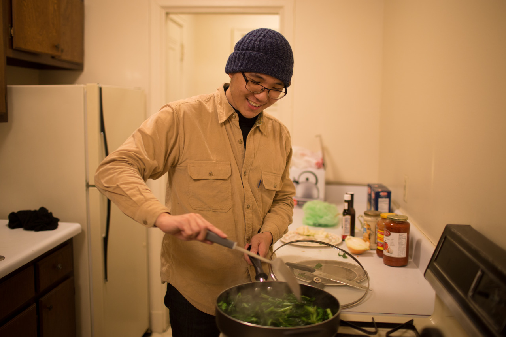

## Hi, Beason

Beason was my classmate at NCTU, who is also now joining exchange program at CMU. However, he had some problems with his visa, so he just arrived here this morning. Although he didn't catch up the orientation, we headed to Target and Giant Eagle again for even more food.

Finally, we were able to cook steak and vegetables at our house, which is extremely delicious. The bad news is that Henry and I are afraid of being too fat if we eat like this way for months. So, tomorrow 9am will be the time for the gym, and hope things will be great as time goes by.

---

*Narita Airport @ Tokyo, Japan. January 9, 2015*
