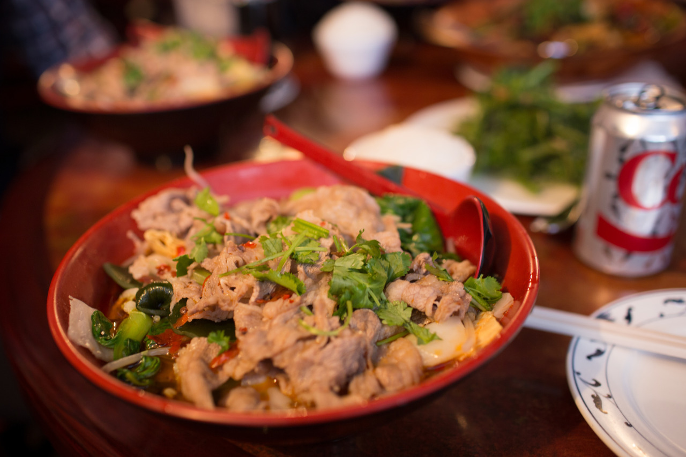

## First Time Downtown

Yesterday was my first time to hangout in Pittsburgh downtown, and it was super cold there. It’s pretty easy to meet friends here, and we are all being nice to each other. Henry, my roommate, and I met a German-born Cantonese during the orientation who became the one invited us for this downtown trip. There are the other two Chinese from mainland China also be invited.

We went to a Chinese restaurant called Hunan Bar for lunch where they got really great food but too much for me. Then, we took a walk in Macy’s and some parks near the coast. I found that I am getting tired more easily in cold weather, which may because that the body has to keep generating the heat.

Night, I went to Li’s room for spicy hot pot. He is one of my friends from Stanford, and has been helping me a lot for settling things down in CMU. So, I had great foods yesterday, and I think it’s time for me to have regular exercising and simple daily food.

In Taiwan or Hong Kong, most of the time we presume a stranger or a new friend may not be a good guy since he or she may just want to gain something from you. However, I found it’s totally different here. I had lots of talks with stranger and people are trying to being nice whenever we meet new people.

---

*Hunan Bar @ Pittsburgh. January 11, 2015*
