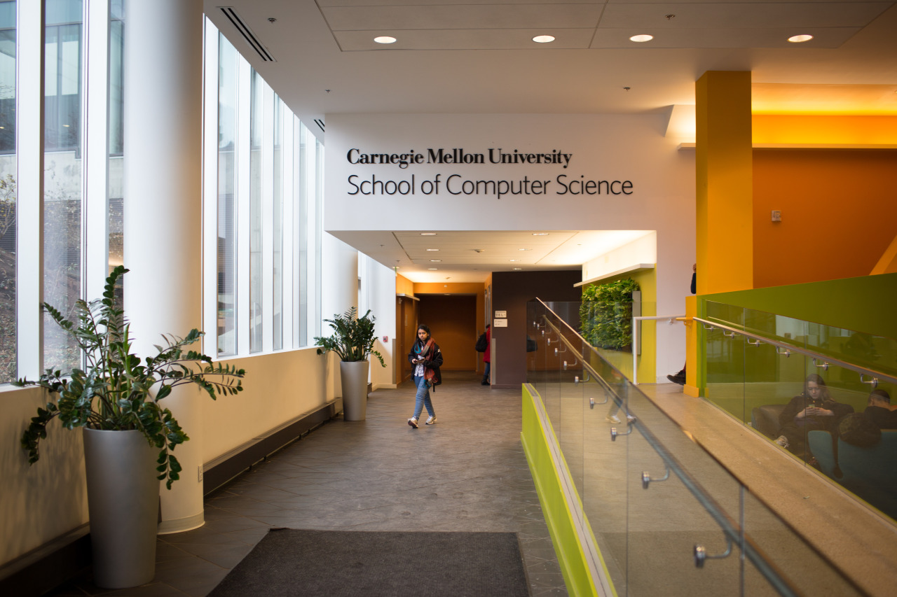

## First Day in the Class

Today is the first day of the courses, which is exciting also challenging for me. Since being an exchange student, it’s hard for me to enroll courses. Beason and I visited our advisor for the course enrollment issue this morning; however, the answer was still the same: wait and join the first class.

Therefore, I went to four courses today. They are "Communication Design Fundamentals", "Network Security", "Rapid Prototyping of Computer Systems", and "Advanced Web Design".

The courses are great but also tough. It’s kind of giving quite a lot pressure since the days in Taiwan was too comfortable. I am listing out some big differences I found in the first class:

- No cell phone, or Facebook is allowed in class.
- No skipping courses, or you will fail easily.
- Homeworks go on in the first class and will be checked in the second class.

Although the pressure makes people feel uncomfortable, but makes us grow as well. It was a hard time for me to get here and study, so I should try as hard as I can. There is still one course called “Web Application Development” which attracts me a lot. Last, I found that I may have less time for photography and blogging because of the load of courses.

(I found some are not true in the end of the semester.)

---

*Gates Hall @ CMU. January 13, 2015*
