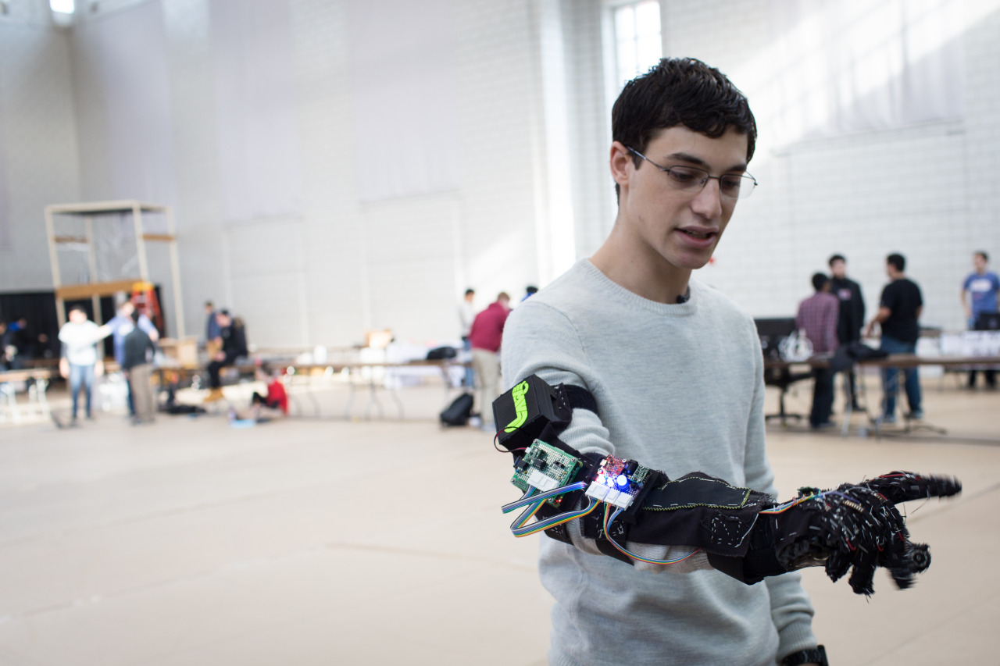

## Build18 Competition

There’s an event called “Build18”, which is for CS/ECE students to build something within a week and with 50USD budget. It’s petty alike as Science Fairs in Taiwan; however, CMU students bring out much more interesting things.

Not all of them are having a serious business plan, but they are great and interesting. For example, I found people build a T-shirt which allows you to place Pokemon game-boy, a bartender machine with website interface, and a grove which allows you to play the piano on air! I believe that it’s also possible to bring this kind of competition back to Taiwan. CMU students are much busier than us, so there would be any excuse for being busy.

---

*Cohon University Center @ CMU. January 17, 2015*
