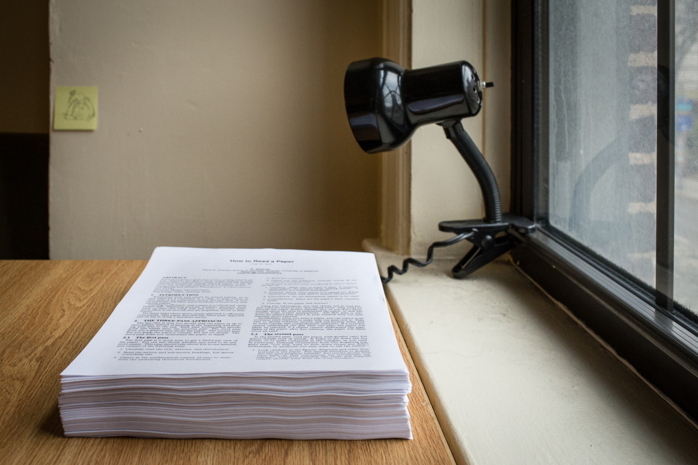

## Under Stress

As I said, the first two weeks at CMU is pretty tough. It’s not only because this is the new environment to me, but also lots of works queueing on my todo list. I am listing them out here:

- Final exams and projects from NCTU
- Course registrations and homeworks
- Meeting new people and settling down

The final exams and projects from NCTU may be the hardest thing for me since I am not having enough time for it. I was asked to take final exam with video call on for invigilation purpose, implemented the last project for Network Programming class, and joined a CTF competition which lasted for two day long.

Courses registration is also challenging as I mentioned in the previous post, I have to email each instructor to gain the permission for enrollment. Also, most of the classes are giving out assignments in the first week, which have deadlines in the second week. For Network Security course, we have to read paper before every class, and write reviews. I've printed out all the paper we have to read within the semester (see photo).

Last tough thing is getting into this new environment, especially the social network. Americans take personal social network seriously, and it's also pretty important for me, as a new comer. I've joined several parties, and tried to talk to people after classes. I hope I can meet more and more friends in the short future.

I understand the stress is tough, but I also understand that makes me better. Taking the challenges and chances is the thing I have to do now, certainly.

---

*My apartment @ Pittsburgh. January 19, 2015*
