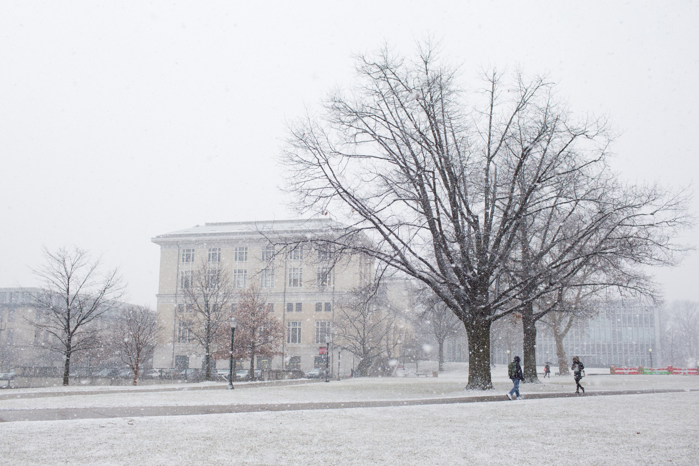

## Swirling Snow

It’s almost the end of the second week now. Most of the assignments from NCTU or CMU are finished, although new ones are keep popping up, I finally have a short break. Yesterday, it started to snow, which was so beautiful. I headed back to my room and grabbed my camera to campus with worries that I may miss any good shot. Nicely, the snow lasted quite long, and it snowed today as well. I enjoy a lot since I don’t really had seen beautiful snow like this.

In the afternoon, I joined a gathering for exchange students. I learned that there are about 6,000 people on campus, and around 50 exchange students. I feel that I am pretty lucky and have the chance to be here.

---

*Campus @ CMU. January 22, 2015*
