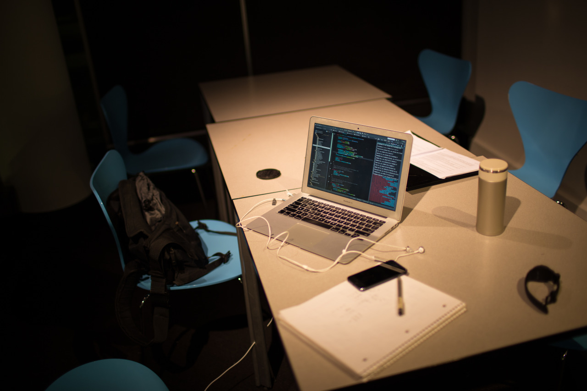

## My Heart is in the Work

Finally,

- the professor realized the assignments were actually too hard and we shouldn't worry too much,
- I’ve met a bunch of people in every courses I took and they are so nice,
- I am used to this weather and every shortcuts between buildings.

Most of the days, I stay at Gates Hall with my friends and study together. People here are having a really strong passion in learning, and trying so hard to understand every details. Instead of only doing my own assignments, I am also really glad to discuss with other people on any problem they meet.Even I may have to stay really late in order to finish all of my works, these days, I started to listen to music while walking on the street. I can feel the beats in the song and in my life. And, I know my heart is now in the work.

---

*Gates Hall @ CMU. February 17, 2015*
