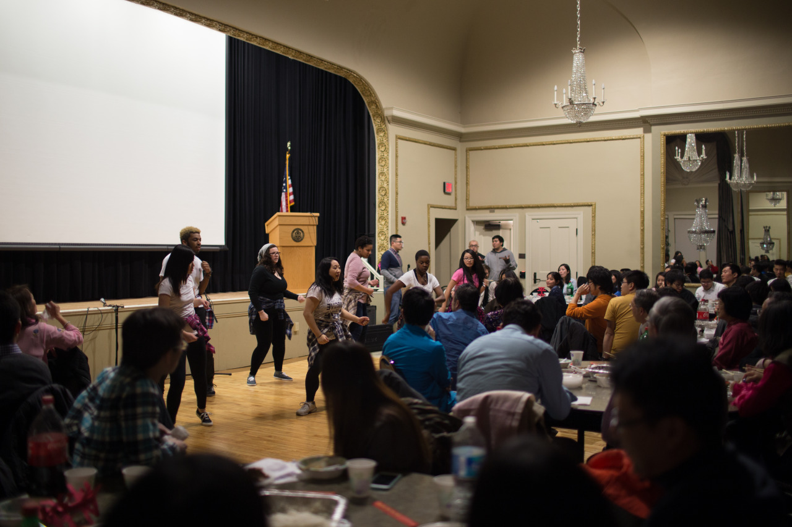

## Same Hometown

Chinese New Year is coming, so TSS (Taiwanese Student Society) held a dinner event on last Saturday. I joined it with my roommate, which turned out the event was pretty fun.

I met a guy, who’s also from NCTU, and his family in the dinner. He told me that he had already graduated and now is working in Pittsburgh. At the time he arrived, he couldn't find many Taiwanese people here. So, he met Chinese girls and now has a beautiful Chinese wife.

During the dinner, there was a Karaoke contest, and one guy sang "Suddenly missing you so bad" from Mayday, which was really touched. What surprised me the most is that he was in the same class as mine! I didn't know that until today's class, and we even went to the same high school, HSNU!

Even though now I am staying in the other side of earth from my hometown, I feel that I am still meeting nice people with big welcomes, and we help each others as much as we can.

---

*TSS Chinese New Year Dinner @ Pittsburgh. February 17, 2015*
