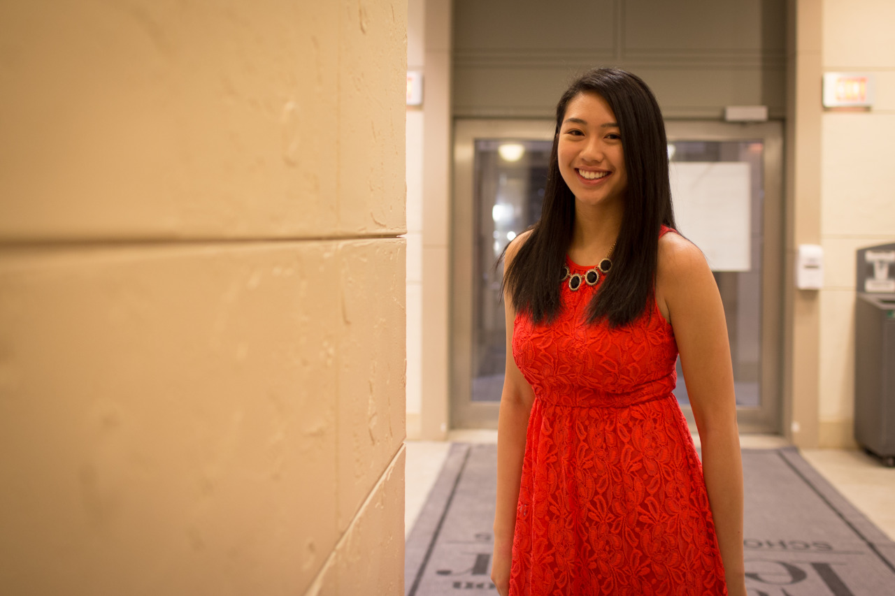

## Smiling Days

> "Andrea and I would like to ask if you can help us take photos?" Megan texted me after our first meet, so I brought my camera to Tepper Ball today.

Unlike the first few weeks in Pittsburgh, I am now more used to this place. Sleeping late became normal for me, then I may have more time joining different events on campus or talking with friends. Besides learning the knowledges in classes, I believe that meeting people is also important for my trip.

I met Megan and Andrea in TSA, Taiwanese Student Association, and they are all pretty out-going girls. Megan told me that she brought Andrea the tickets for Tepper Ball since today is her birthday, and she would like me to help on the photos. I am glad to help, and also glad that they like the photo in the end.

---

*Tepper Ball @ CMU. February 21, 2015*
