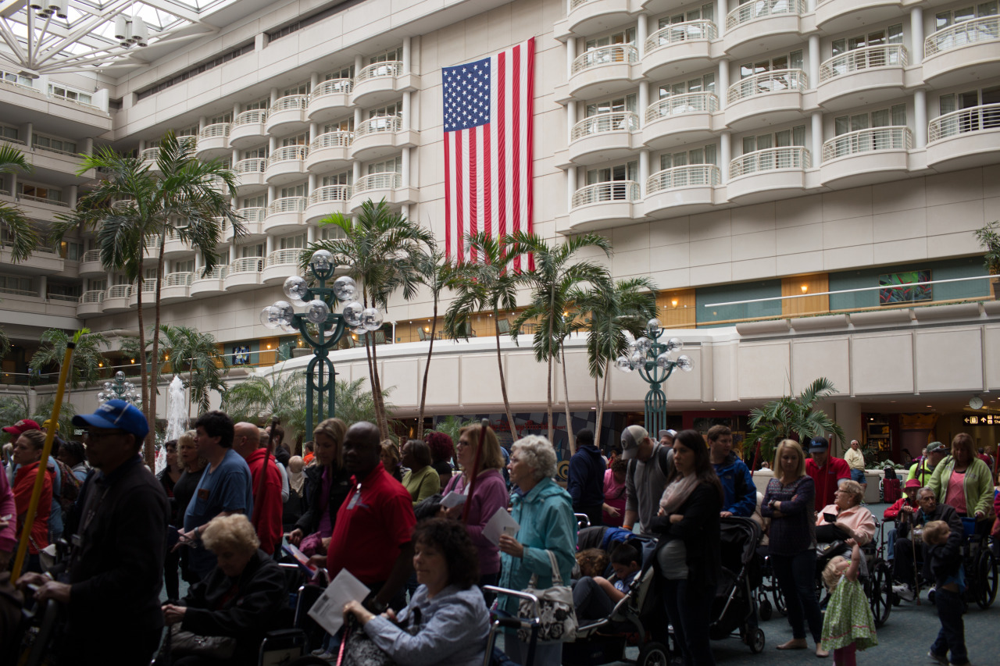

## Arriving Orlando

*Spring Break Day 1*

Okay, this vocation should originally be kicked off on Friday, but the flight was delayed. So, Saturday becomes the beginning of this break. We waked up at 4am, and took 8am flight from Pittsburgh to Orlando. Then, we visit LEGO Land after arrival. In the night, we walked around International Drive, where is a place for restaurants and stores.

We took Uber to get to LEGO Land, which last for one hour, but the price is reasonable. However, the ticket for LEGO Land is much expensive than our expectation; also, the stuffs in LEGO Land were actually for kids. Therefore, the time in LEGO Land was not really fun, but kind of remarkable for us.

Even though people say that we should treat all kinds of people the same, I found that there are some people they don’t really want to talk to us, as Asians. I am not sure why this happens, but I feel bad when people don’t answer the questions. This reminds me that I should always treat different people in the same way.

---

*Orlando International Airport @ Orlando. March 8, 2015*
