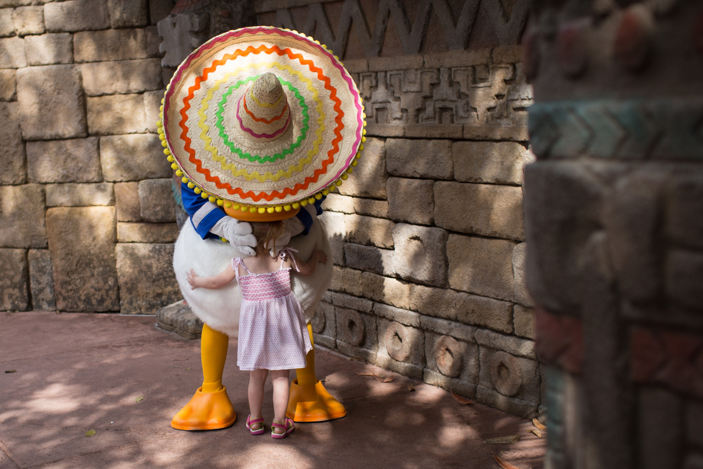

## Disney!

*Spring Break Day 2*

Finally, it’s time for one of my childhood dreams to come true: visiting the biggest Disney in the world! Disney Land in Florida is the biggest Disney all over the world. As far as I know, there are 5 Disney in total, which are in Japan, Hong Kong, LA, Florida, and Paris. I’ve been to Japan Disney when I was little, Hong Kong Disney with my father 6 years ago, and LA Disney on my own 3 years ago. And, I hope I can visit Paris Disney someday soon.

There are 4 theme parks in Florida Disney, and it's impossible to visit them all in 2 days. So, we visited "Epcot" for the first day, and "Magic Kingdom" for the second day. "Epcot" was composited by several country themes, which means one can find Japan, China, Mexico, etc in "Epcot".

The most-highlighted part today is meeting my best friend, Donald. He has been my best friend for 20 years, and I was really excited that I can finally meet him in Disney. I pulled out my notebook and ask him for a signature; also, we took photos together! I remembered that the first photo on my Facebook was in 2009, and that was a Donald Duck token by Chieh in Florida.

In the evening, we visited “Disney Downtown”, and that was a really fun place. I saw Rap Battle on the street, live pop/rock music, and lots of fancy stores.

In this first day Disney visit, I found that Disney build their parks into details, which is the thing that we should all learn from. The signature I asked from Donald is having the same as the one printed in the store. And, Donald Duck in the park is having the same personality as the one in the TV, he is both fun and likes to play with friends.

---

*Disney @ Florida. March 13, 2015*
