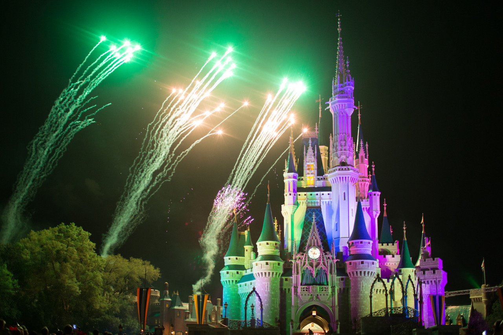

## Magic Kingdom & Meeting Chieh

*Spring Break Day 3*

Disney is a place where dreams come true. Once we arrived “Magic Kingdom”, we saw all Disney characters were dancing in front of the castle, and sang that we all should believe the dreams would come dream. Though I may be a little too old to watch Disney series, but I was touched and realized that we should always believe in dreams no matter what.

Magic Kingdom is more crowded than Epcot, and we went there by taking ferry from the entry. And, before we left, we watched the firework which was really good for photos.

The last part of the day was tough, we have to go back to our hotel for luggages and catch Greyhound at 12. Hopefully, Chieh and her friend came and drove us to the Greyhound station. So, the plan was that we left Disney right after the firework, took a bus to the closest resort, called a Uber to our resort (no bus to our result from Disney directly), meet Chieh in our resort, and her friend drove us to the Greyhound station. The greyhound bus was heading to Miami, we took another Uber to our hotel after arriving Miami, and check-in at around 4am in the morning. We were lucky, most of the time fit into another, but it’s also risky to have this kind of plan. If we missed any of the buses, things will mess up everything.

However, the happiest thing during the day is meeting Chieh in Florida. She has been my good friend for 10 years, and we can only meet around once per year when she’s back to Taiwan. I've been saying that I should go Disney and find her in the states in the future. Finally, this dream came true.

---

*Disney @ Florida. March 13, 2015*
