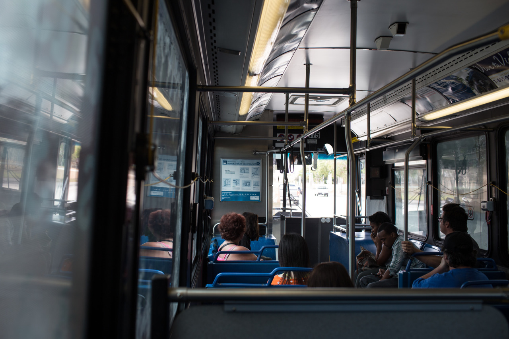

## Miami Zoological & NBA Heat

*Spring Break Day 5*

Yes, we went to Miami Zoological and Heat Arena for NBA game today.

Miami Zoological is quite far from us, so we have to take monorail first, change to a bus, and then take Uber. It’s located in a wild place, and they feed a variety of animals including lions, snow leopard, etc. If one is paying extra money for the tour, he/she can interact with little lions or other animals. It funnest part for me is playing with the baby monkey since it’s so cute, and also not afraid of people at all.

In the evening, we went Miami Heat Arena for the game between Heat and Nets. Although the Arena wasn't fully seated, people are still really excited watching Heat won the game.

---

*Miami Zoological @ Miami. March 13, 2015*
