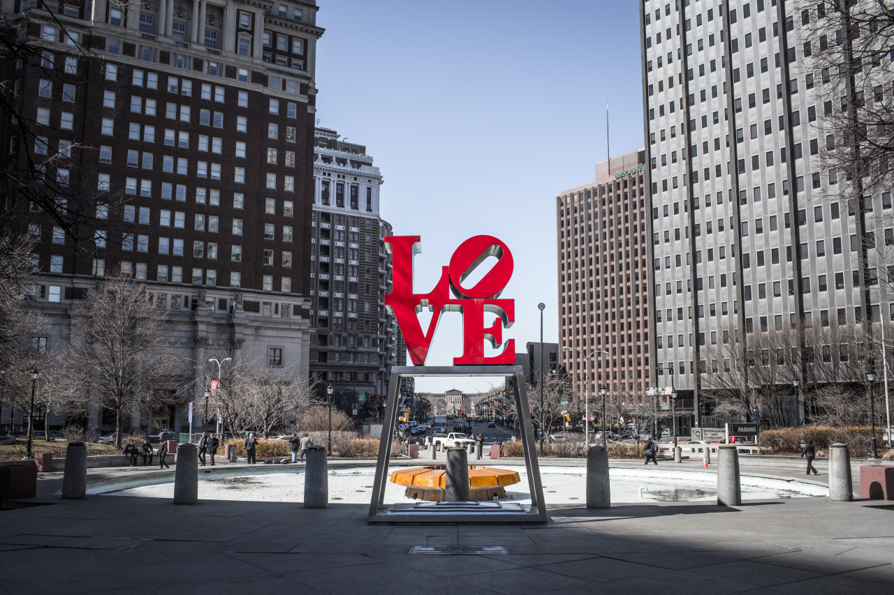

## Philadelphia City

*Spring Break Day 6*

Philadelphia is the third and the last city for this Spring break trip, where it’s also my favorite city. When we arrived downtown, I saw skyscrapers and a variety of stores. I felt that I can hear the tempo of the city, and also found that there are so many things I can discover.

Sadly, in the afternoon, I have to stay in hotel and do my work. However, I did went out for a walk in downtown and also had a really good Korean food for dinner.

Philadelphia is the forth biggest city in America, and they have lots of traditional British buildings. One may feel living in Europe here, and this is the reason why I like this city.

---

*JFK Plaza Park @ Philadelphia. March 13, 2015*
