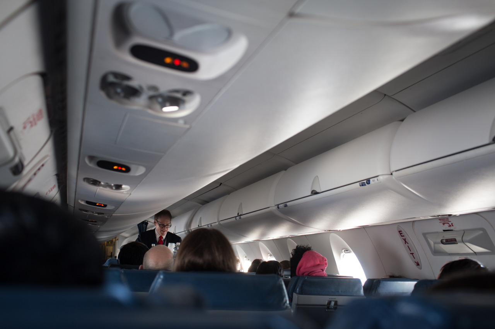

## Back to Life

*Spring Break Day 7~9*

Last few days in my trip I didn't go many places but stay in hotel for my assignments instead. While I was in Philadelphia, I did walk around the city a lot and also took the tour bus which brought us all around the city. Sadly, when we arrived the art museum, it was about to close so we didn't go into it. That became a good reason for me to visit Philadelphia again in the future.

Finally, this trip is end, and it’s time to back to school. This is my first time taking so many flights within one week, and we had really tight schedule. Hopefully, the trip was safe and we didn't encounter any problem.

To sum up, Orlando is a really fun place for visiting Disney, and even we’ve stayed there for two days, we hadn't finished all the parks. And, Miami is a nice place for beach and sunshine. In our trip, We didn't visit Key West (a place close to Miami), but I would definitely want to go again when I have a car. Last, Philadelphia is a city full of culture and history, which I like a lot. I really enjoy the time randomly walking around in Philadelphia.

---

*Flight from New York City to Pittsburgh. March 16, 2015*
