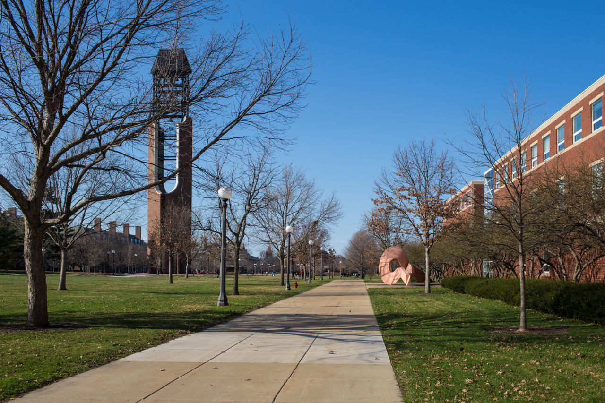

## Let’s Talk About American Taiwanese

*Visiting UIUC*

For this weekend, people from CMU TSA and I went to ITASA Midwest conference at University of Illinois at Urbana-Champaign (UIUC). The conference is three-day meet-up for Taiwanese student associations from different colleges to gather and know each other, and, thanks for TSA, I can joined this awesome trip. By the way, UIUC is another popular college on our exchange school list, which I was thinking getting there before.

We started to drive there from CMU in Friday morning, and it took around 8 hours, then we had some drink which ended up the day. The second day was the highlighted part, I joined three workshops during the day, and they are really worth for me to share what I learned.

"Page 228, A Glimpse at Taiwan's Story" is the first workshop talked by Julie Wu. She's an American born Taiwanese, and she had a little knowledge about Taiwan when she was little. All the things she can know is heard from her parents' story. And, she didn't know 228 history event until she's 30 years old. She found that it's important to share Taiwanese histories to more people like her, which made her to write a novel called “The Third Son”. The book is in English and beloved by American Taiwanese parents or educations, which is a really good way to make more people know Taiwanese modern history.

228 incident, an anti-government uprising happened in Taiwan in 1947, is one of the most important events in Taiwan’s modern history, and also a critical impetus for the Taiwanese independence movement. However, what surprised me the most is that when the audiences were asked whether they know this event or not, not much people raised their hands. Some said that they only know this history recently. I was surprised since I was learning this incident when I was in middle school, and we even had to studied every details of this event so that we can know what happened to our last generation, and think about how to solve the problem in our generation. On the other hand, for those American born Taiwanese, they have totally different background from us, which is no right or wrong. But, it's always good to know more about our own culture or our parents’ culture. In the end of the workshop, I saw students brought her book, and talked to Julie about what they learned.

“The Road Less Traveled” was the second workshop, the speaker was an illustrator. She’s now drawing illustrations for national parks; however, this was not the point, the point was that she shared how she found her true passion. She asked us to fill out the following blanks in the paragraph:

> Hi, I’m \_\_\_\_\_.
>
> I care about \_\_\_\_\_ (value), because \_\_\_\_\_.
>
> I enjoy (value), it makes me \_\_\_\_\_.
>
> I hope to \_\_\_\_\_ (long term goal) by \_\_\_\_\_(action).

I really like these blanks which make you think what you’re doing now, and what’s the thing you’re believed in. For me, I am caring about the interaction between technologies and human connections because that’s the things we are facing everyday. I enjoy it, it makes me feel passion. And, I hope to make people have a better life by creating something people want.

Interesting, everyone in the workshop has different answers. One cares about organizing transportations, one cares about material designs, one cares about money, etc.

"An Act in Three Parts: Passion, Purpose, People" was the last workshop also my favor one. The speaker first asked us to know each other within few minutes, which is not a hard problem here. I talked to the one next to me, and asked her name, major, and where she’s from. However, the speaker said that this may not be enough. What makes one different is your own passion, which reflects to your action. Like the second workshop, we all should recognize our own passion first, and think about what skills should we have, then take actions. So, a better way to meet people or to interview, is asking their passions, and their real actions. For me, I believe in creating stuffs to make people have better life, so I write programs.

More, there was another keynote speech in the morning, which was hosted by Edwen. He's now a mandarin pop singer in Taiwan. He was talking about his struggle life for 8 years after college. He followed his heart and then became a song writer. Finally, recently he was found by Taiwanese music publisher, and became a star. He is also an American born Chinese, and his music is loved by Taiwanese people, which is totally a world he had never been to. He played his songs from his different periods during the speech. In the end, he said that we all have our own stories to write, but remember, we should be the ones who hold the pen.

We went to a formal dinner, bar, and headed back on the third day morning. Beside meeting people from different part of America, I started to think about American Taiwanese because of this conference. No matter American Taiwanese or Taiwanese, We are all sharing a same background, but different life. If I am staying here in the future, how will the life be then?

---

*University of Illinois at Urbana–Champaign @ Illinois. April 6, 2015*
