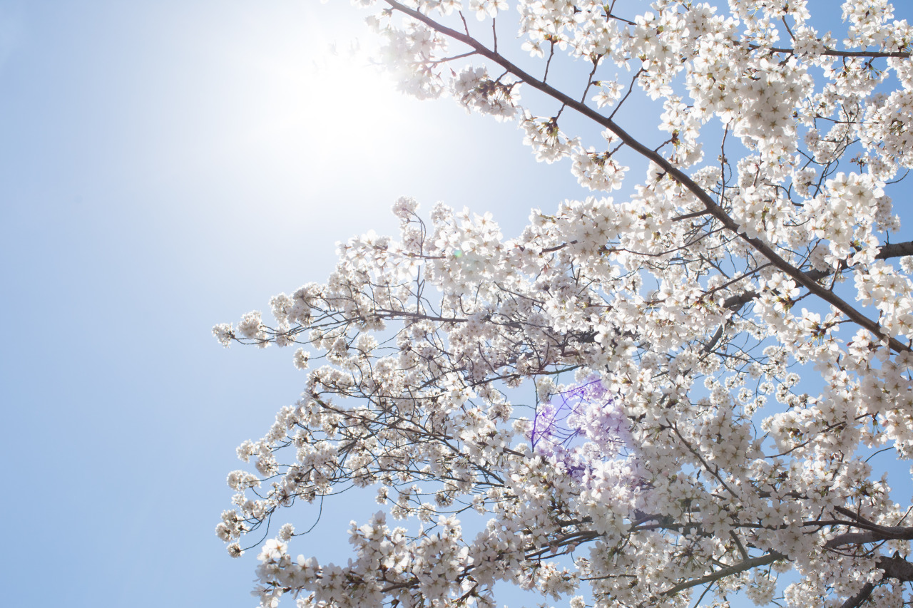

## Japanese Sakura in Washington

My friends have been talking about this trip since last month, and finally I finished most of my works then went on the trip: Washington! In 1912, Mayor Ozaki of Tokyo City donated 3000 Japanese Cherry trees in an effort to enhance the growing friendship between the United States and Japan and also celebrate the continued close relationship between the two nations. As the time goes by, people started to have an annual festival when those cherry trees blossom, which usually only lasts 1 to 2 weeks.

Anne, my friend in Taiwan, had told me about this festival half a year ago, and I am glad that friends in class are also planning this trip. We departed in Saturday morning, and visit the festival, Madame Tussauds museum, then went to a really nice steak house in the evening. In the second day, we headed back in the morning.

---

*Washington D.C. April 13, 2015*
