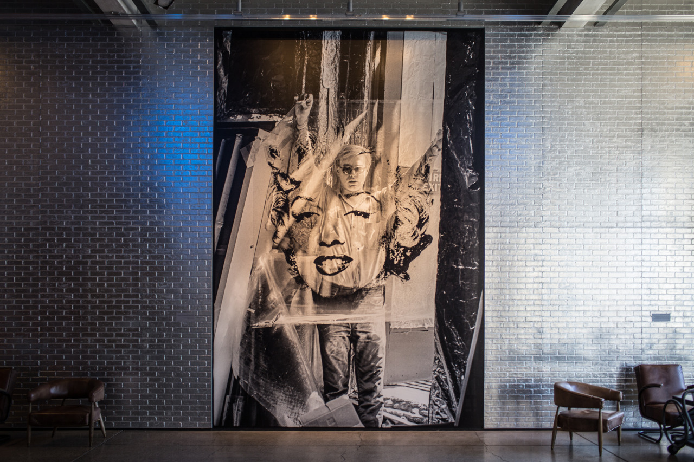

## Meeting American Pop Art at Andy Warhol Museum

> "Do you get it?" An old lady walked by and asked.
>
> "Get what?" I replied.
>
> “All these stuffs here. In my opinion, these are craps, and I like traditions.”

Today, I went to Andy Warhol Museum in downtown. Andy is an pop artist, and his work includes paintings, photographies, screen printings, etc. He is also the guy who paints the famous Marilyn Monroe. Actually, his works and American pop culture are new to me. I feel that the color is too vivid for me, but also found it is pretty representive for American culture.

The old lady talked with me for a little while. She said that she admire traditional Chinese culture since that teaches people how to respect each others, and there’s no such thing in American culture. I think she is right. We meet different cultures, and we should also learn from different cultures.

> "What’s your name?" she asked before ending the conversion.
>
> "Heron"
>
> "No, your Chinese name."
>
> "Okay, Yang Hsiang Yu."
>
> "Yang Hsiang Yu? Nice."

---

*Andy Warhol Museum @ Pittsburgh. April 25, 2015*
