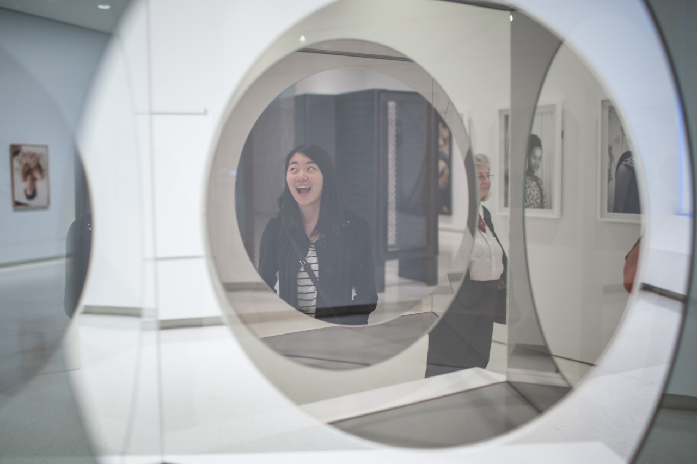

## Oh, We Got Museums!

"2 of 4 Carnegie Museums" Tiffany read out the line written at the entry of Carnegie Museum of Art. Okay, finally we realized that we have such many museums at CMU.

The weather was really nice this Saturday afternoon, the temperature finally went normal and felt like summer was almost arrived. Tiffany and I went to museums next to the campus, they are Carnegie Museum of Art and Carnegie Museum of Natural History. Things in these museums are very diverse, we've seen modern artworks, photographies, specimens of birds, etc. Some of them are creepy, which make people dizzy, but I think that's also their point.

It's midnight when I am now writing this paragraph, recalling my day, specimens of birds are the most memorable part. It’s not because I am new to or crazy about birds, it's because that Tiffany showed me the video about these birds. The videos was about male birds dancing in the forest to attract female birds, and their dance was really awesome.

I can hear that Mr.Farewell is knocking on the door, and I know it’s about to say goodbye to this place and people. I am trying hard to finish all the things I supposed to do (a.k.a. "missions") and also meet people who are friends forever.

---

*Carnegie Museum of Art @ Pittsburgh. May 3, 2015*
