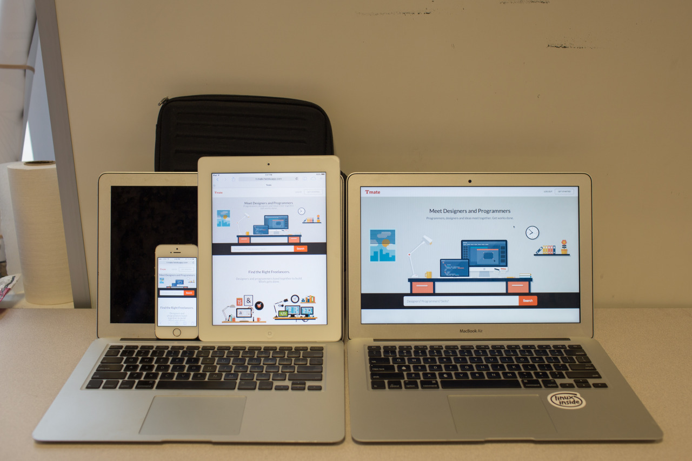

## Last Few Miles

Can you hear tick-tack, tick-tack, the sound that is getting louder and louder these days? It's my last week staying here at CMU, and it's also the week for final projects and exams. My teams and I have been working really hard to bring out the best. In the same time, I also take chances to meet with friends.

For one graduate class I took, the team had been fighting for quite a long time since we had some different opinions. However, we tried to bring out the best result for the project, which turned out that we actually wrote a nice paper and poster. It’s the first time for me to write formal paper, and to work with international students in a such intense way. I learned a lot during the communication with the team, which is much more meaningful than the project.

For the web design class, we worked over night before the presentation day. It was crazy but it worth. Working with people with nice design sense is fun, and I enjoyed the way we cooperate: one went first for the mock-up, the second one did the front-end coding, and then I did the last implementation part. Staying in the library over night, I found it was really quiet and the cafe was still open. Fortunately, we finished the work, and delivered today.

I had a dream that I started to miss this place badly when I back to Taiwan. So, to make it better, I am trying to take more photos and meet people these days, then I may not miss this place that much in the future. However, I really appreciate everything I had here. And, this trip isn't going to over here, the another part of my journey is going to kick off soon.

---

*Final Demo @ CMU. May 7, 2015*
