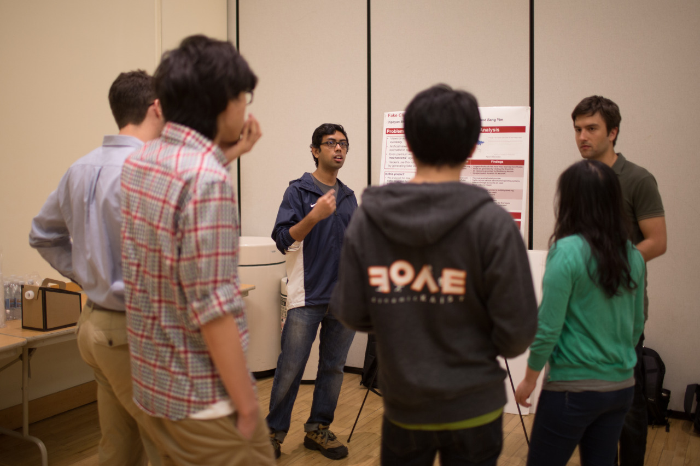

## Ya, Buckstar Rocks!

Buckstar is the name of our team for Network Security final project. We have very diverse team members from all over the world including ABK, Turk, Indian, and Taiwanese. It’s really fun to co-work with these guys since we have lots of things to talk between different culture backgrounds. We hanged out to Washington DC, had meetings regularly, and also fight with each others.

Our study is about generating the fake views on YouTube videos, and we've been working on this problem for half of the semester. It was hard since even understanding the problem is hard. Finally, We came up with real statistics from fake view vendor, and wrote our own code to generate fake views.

Today, we won the second prize in the final presentation. It was a great experience working with Buckstar, and it's time to move on.

---

*Final Poster Presentation @ CMU. May 8, 2015*
