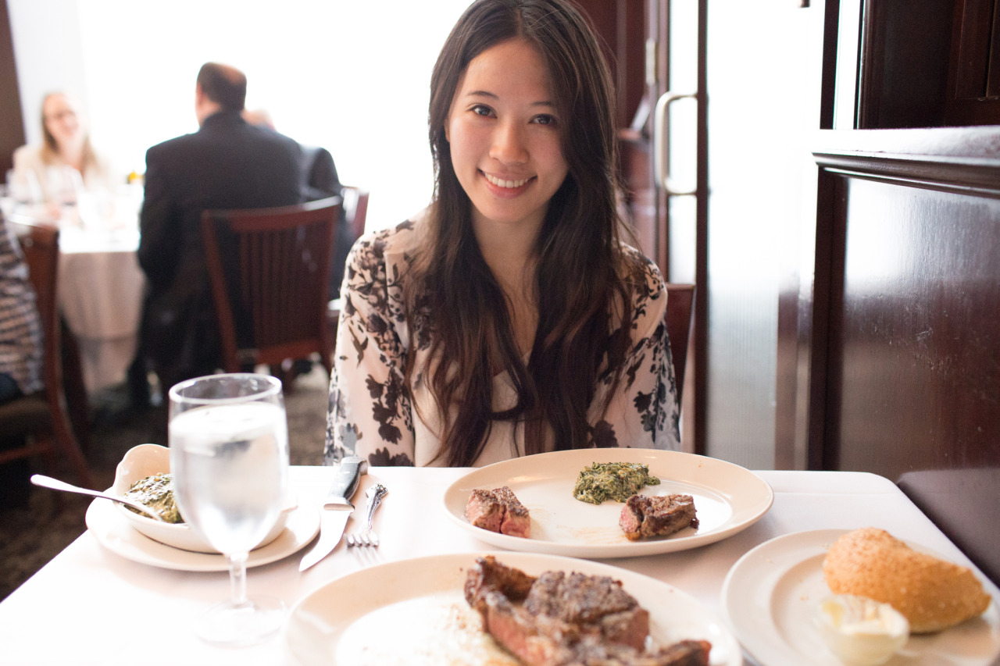

## Yo, New York City!

*Day 01*

New York! Finally, I met my friends for 10 years, Kim, here in New York. And, she will be my tour guide for the following week for exploring this city.

Basically, we've been to Brooklyn and some other multiple places in the first day, and had a really nice steak as dinner in Del Frisco’s Double Eagle Steak House. So, followings are the places we've been to:

- Wall Street
- Brooklyn Bridge
- Shake Shack
- The Brooklyn Ice Cream Factory
- Dumbo
- Chinatown
- Little Italy
- Del Frisco’s Double Eagle Steak House
- Bryant Park
- Rockefeller Center
- Lincoln center
- Fordham University

It was a really nice day, I enjoyed the dinner and the time with Kim. People in New York are very diverse so there's always lots of things to see and to do even just shuttling in the city. However, when the time Kim asked me "so, what do you think about this place?" I couldn't answer it well. After being so many different cities these years, I am afraid that New York City wasn't surprising. Hmm, but when the time I gave out this response to Kim, we made a turn then encountered Lincoln Center, which was amazingly beautiful and hold my breath. Yes, that surprised me. So, this reminded me that the world is big and surprises never end.

---

*Del Frisco’s Double Eagle Steak House @ New York City. May 15, 2015*
