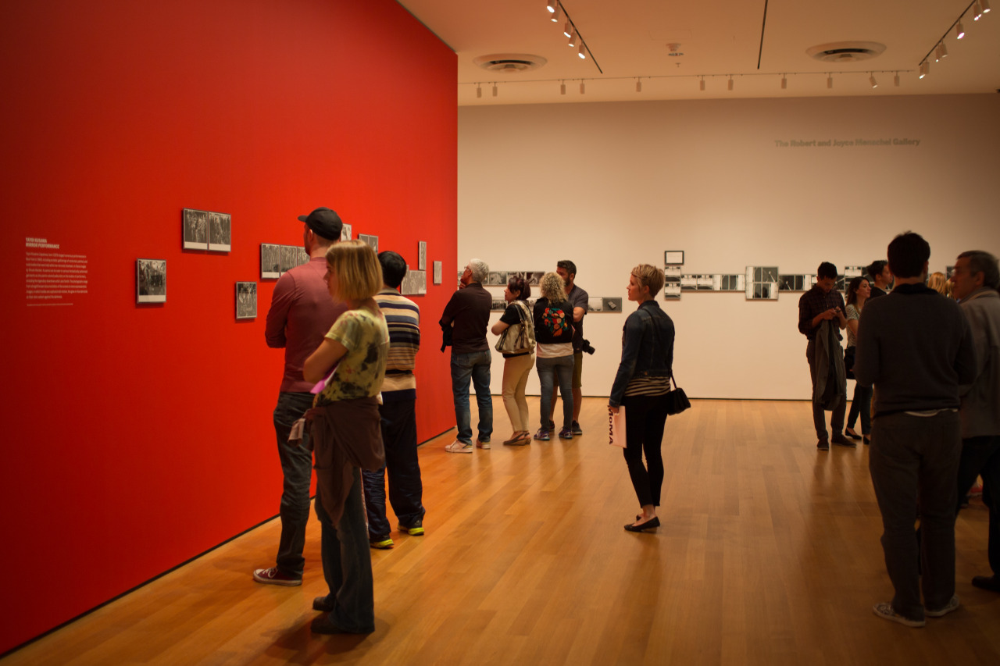

## Meet Some Arts

*Day 02 ~ 03*

So, for the second day in New York City I went to Kim's previous living place with her then visited Grand Central Terminal in the evening for photos! For the third day, Kim and I went to MoMA (Museum of Modern Art) together, where I met my favourite art piece - "Number 11", 1952 by Jackson Pollock. I may not understand every story behind those art pieces, but I can feel the motion from some of them. Just like standing in for the "Number 11", I can't stop thinking something happened years ago. Days in America feel like a dream-is-almost-coming-true stuff for me.

---

*Museum of Modern Art, New York City. May 18, 2015*
