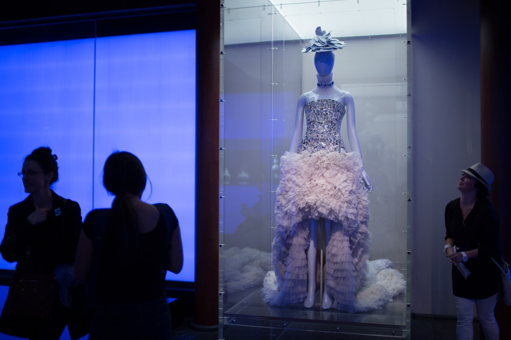

## Fashions in Ancient Asian

*Day 04*

Here comes my forth day in New York City. Today, I went to Central Park for a really long walk, then visit Guggenheim Museum and Metropolitan Museum of Art. Central Park is pretty big and lots of different types of artists there, so people can just walk around and enjoy the performance easily. And, the museums are awesome as well, especially the Met, which is so big and contains lots of big art pieces.

My favorite one is the roses from Vincent van Gogh. Even though the roses should be red, they are painted as green which is light and Elegant. I stayed for a long time in front of this painting, not only seeing the painting, but also watch people's reactions. Before leaving the museum, the last session I went to was the some fashion clothes, but they are designed based on ancient Asian stuffs.

---

*Metropolitan Museum of Art, New York City. May 18, 2015*
