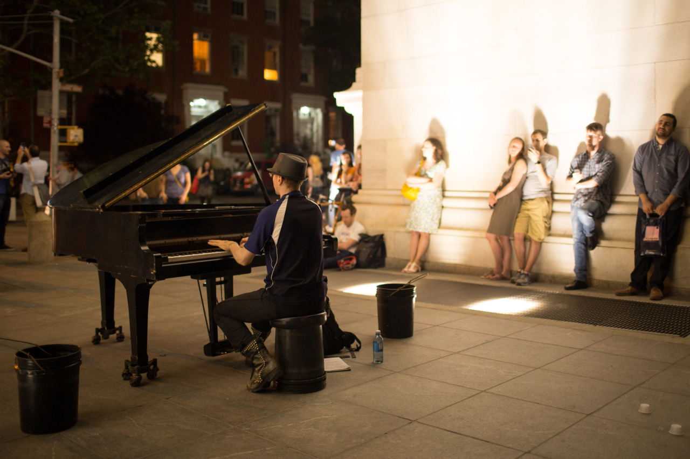

## More in New York City

*Day 05*

Today, I think it’s the fifth day of my New York trip, I went to Columbia University to celebrity graduation of Kim’s roommate. Then, we went to STOMP, a Broadway show using the body and ordinary objects to create a physical theatre performance. In the evening, we had really nice Japanese Ramen as dinner.

After the dinner, Kim took me NYU, where was her dream school. Unlike other universities I've ever seen, it's a university that locates in a busy city, and the buildings look superb. Near NYU, Washington Square Park is another good place we visited. We met a street pianist who plays quite a lot classic music. Comparing to the music I've heard before, this guy plays more exaggeratedly, and I think it's because this is street music then that’s the way to attract passers.

---

*Washington Square Park, New York City. May 18, 2015*
