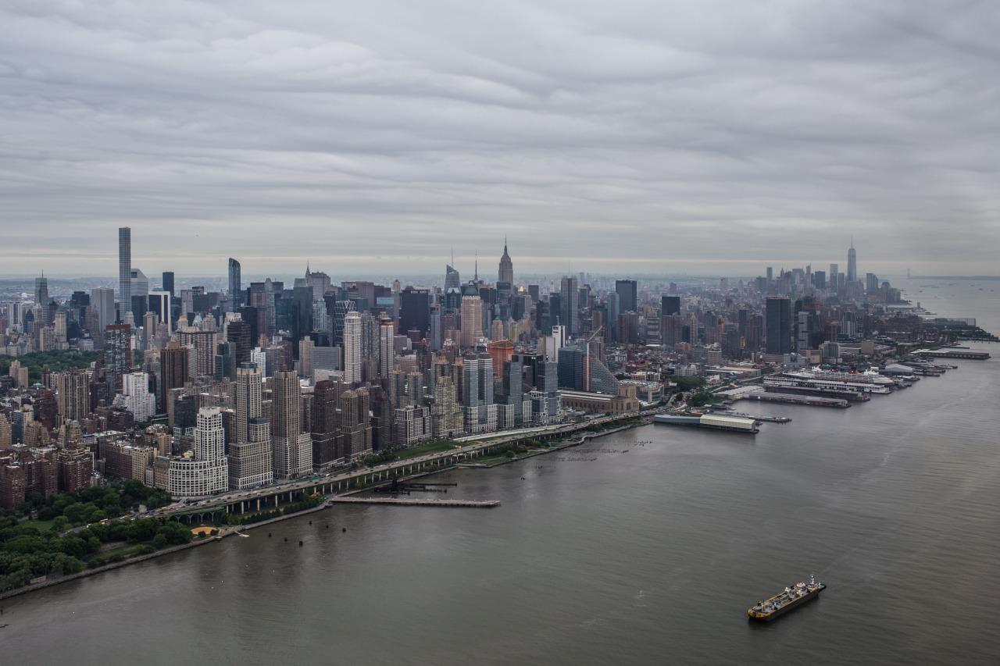

## I Believe I Can Fly

*Day 06*

I believe I can fly. Wait! I am actually flying!

We went to Pier 6 for the helicopter, which we had made the reservation last week. The most exciting part is the moment that the helicopter left the ground. Everyone was yelling "wow~" in the same time. The helicopter flight through the whole New York City, so we can see the time square, all the skyscrapers, Columbia University, Brooklyn, and almost everything from a bird's-eye view.

We've taken quite a lot of photos and videos. Even though the flight only lasted for half an hour, the memory will last forever.

---

*Sky of New York City. May 20, 2015*
