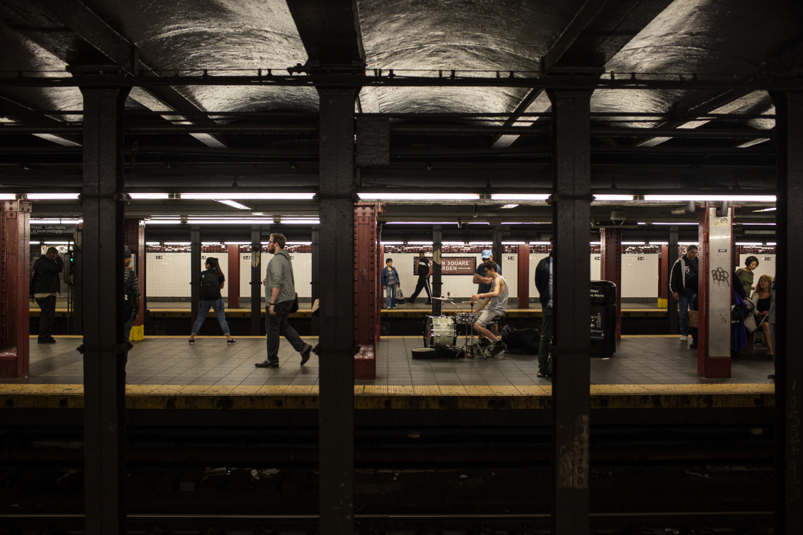

## New Jersey, New York City’s Neighbor

*Day 07*

Tiffany, my buddies from CMU, and I thought that last week may be our last meet. However, we found out that we can actually meet somewhere near New York City since I am staying here for a long time and she lives in New Jersey. And, although I haven't been to all the places in New York City, which is impossible, I think I have been to enough places these days. So, Tiffany and I decided to go Princeton University and see what it looks like. Tiffany's sister also joined this trip, and they are so nice because I was to one who wanted to go Princeton.

Yes, I like the campus which reminded me the days in Stanford. It got its own museum, shopping area, old but pretty buildings, and also modern buildings. People in Princeton are nice, we can simply tell from the experience of visiting their art museum. The admission was free, and the lady gave us a key to store our bags. Another lady asked us to have a magazine when we left. She also kindly told us which part is okay for photography, which part is not. By having this one-day short visit in Princeton University, I can tell it's a good place for studying where you have enough resources and diverse academic programs.

---

*Subway Station, New York City. May 20, 2015*
