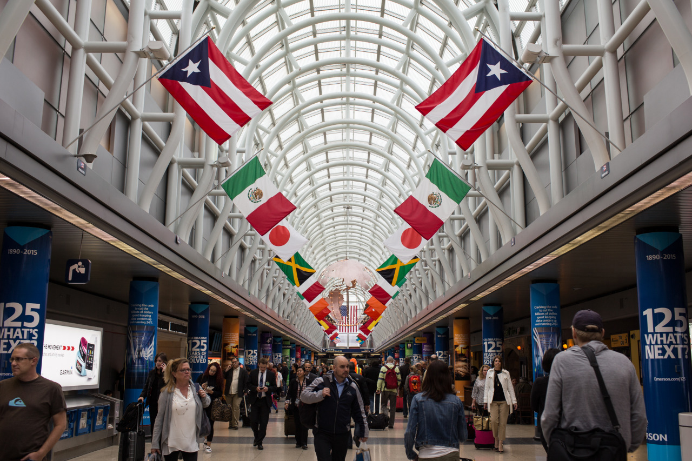

## Say Hi to Chicago

*Day 08*

Kim and I woke up early this morning, and we cleaned up the room after the breakfast. Then, I left. Ya, I left for the flight to Chicago, which is my next stop for this one-month-long journey.

The flight was easy, it took less than three hours, and everything went smoothly. After arriving Chicago, I am now alone for the trip, I took the subway from the airport to my hostel. The hostel was okay, and I met few new friends here. They are from different backgrounds, one is from New Jersey, other two are from IceLand. However, they are all about the same age as mine, and they all went to school in United States like me. The difference is that they may not be the one who studies in those "famous" colleges, but they enjoy their life more than us. They are pretty nice to new friends, and my roommate is the guy from New Jersey, who likes to talk in this way: "Yo, man. Good morning, man. See you, man." Nice.

---

*O'Hare International Airport @ Chicago. May 22, 2015*
