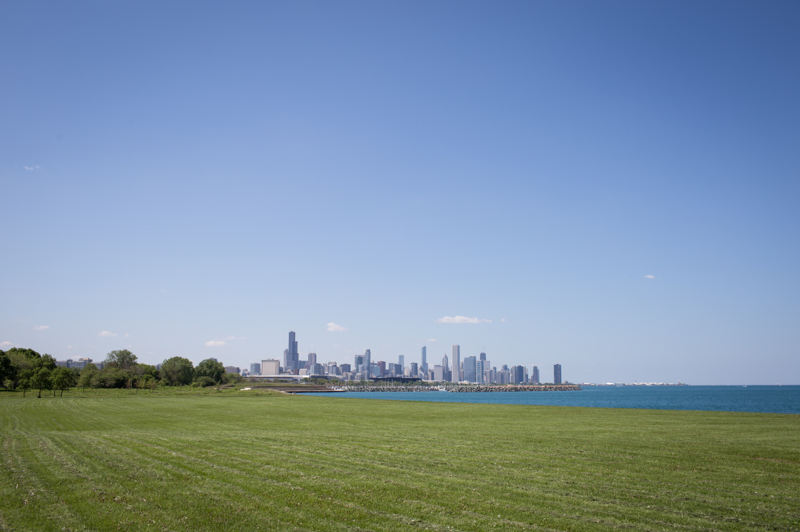

## Biking Rocks

*Day 09*

Andrew is a really nice friend whom I met during my UIUC trip in April. He’s from Chicago, and took me around today. We first met at Chinatown, where is 30-minute subway ride from my hostel, then biked all the way down to University of Chicago. So, it took one hour to go there and another one hour to come back. We stayed on campus for few hours for visiting their buildings, libraries, dinning houses, etc.

Comparing to other cities I’ve visited, I found it’s darker and much quiet in Chicago. People usually get poker faces walking on the street, and the lightings in most of the places aren’t that good. I also had been told that some area in this city is not safe, where I should avoid going. Actually, this is new experience for me. After traveling many cities in different countries, I am always aware of safety, but haven’t been like this before, which I can feel the city isn’t that bright.However, that may only be my imaginations since I met Andrew, who treated me pretty nice. And, I also met some friendly people in the subway and in the hostel. I shouldn’t judge this city at this point, and should look forward plans for tomorrow instead.

---

*Lakefront Trail @ Chicago. May 22, 2015*
