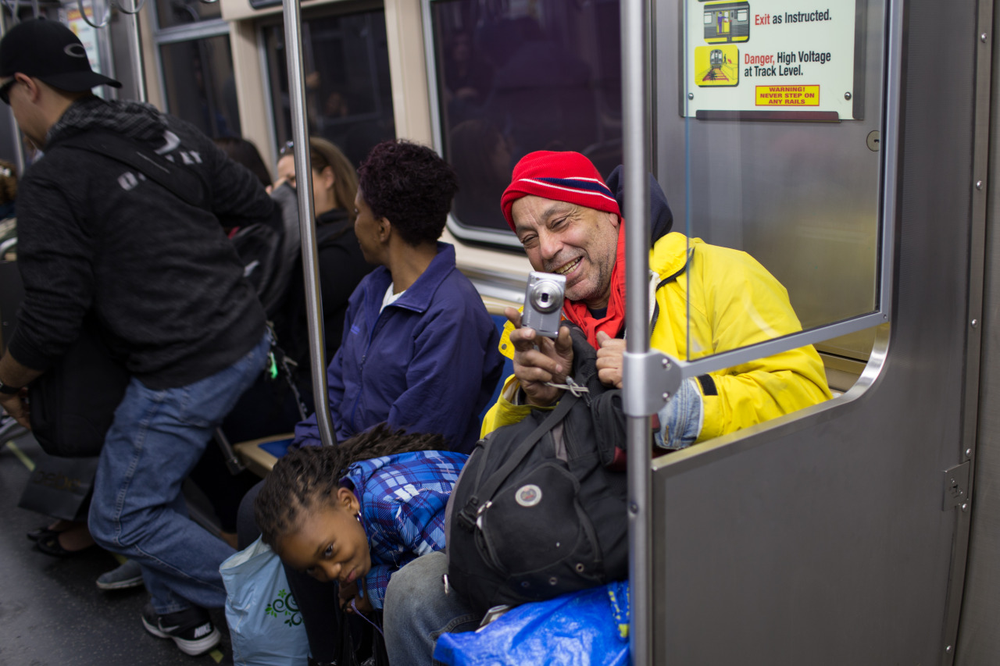

## I Met Stories

*Day 10*

There are two, and happened in this Chicago City.

“This guy is a photographer! He took photos for The New York Times” the stranger started to yell loudly when he saw me carrying a big camera on the train. “Hey, I am not” I replied, but he didn’t care and kept yelling. “This is great city, you have lots of places to take photos.” he said. “No, this city sucks! It’s dirty, boring, and dark.” the girl sitting on the other side replied, and they started a long debate on this. I like this conversion since it’s between random strangers, which rarely happens in Taiwan. People have different opinions on this city, and we are always cool to discuss about it. This short conversation changed my mind, and I started to like this city where I can find stories. Before I left, I took a picture of him when he tried to take me.

Second story was from my roommate. I talked to him before he went to bed tonight. He’s from Ireland, and studies Applied Math in college. Rather than living in local town during the summer, he and his friends decided to come America and experience the life here. They went for work for couple of hours everyday, and walked around the city in the rest of the day. And, they found living in hostels is too expensive for long term living, so they were tring to find an apartment to move in these days. He told me that this is stressed but also fun since they have to deal with the applications, the forms, and work in the same time. Though it is tough, but it is much better than working in their local town. Even though his story inspired me, he wasn’t that friendly when I introduced Taiwan to him. It is because, in the end of the conversion, he said “oh! I know there’s a good Thai restaurant down the street, you should check it out!” Okay, I think he just mixed up Taiwan and Thailand, which is a famous problem that happens all the time.

Andrew and I took a Seadog river & lake architecture tour this afternoon, and before the ride, I stayed in Starbucks for whole morning for working and studying. The tour was amazing which took us from the pier into the city, so we can see all the skyscrapers on the both sides. However, most worth-sharing part is the two stories I mentioned above.

---

*Red Line Train @ Chicago. May 24, 2015*
