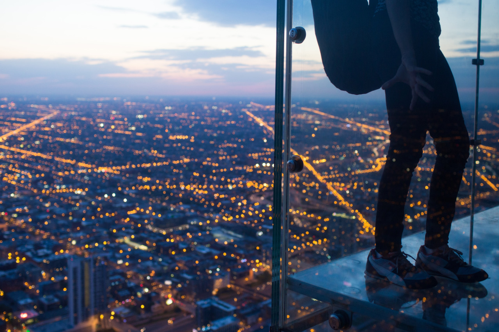

## Finally Found the Spot

*Day 11*

As past few days, I woke up early and stayed in a cafe nearby in the morning to get some works done. Then, I headed to Lincoln Park Zoo in the afternoon, which didn’t reach my expectation. There are so many kids because of Memorial Day national holiday. I could barely see the animals but kids everywhere. So, I left and went to Shedd Aquarium right after.

Sadly, She’d Aquarium even more crowded than the zoo, I have to line up for an hour to buy the ticket, which I gave up at the end. So, I headed to Willis Tower for the night view before this day ended.

Willis Tower surpassed the World Trade Centre towers in New York to become the tallest building in the world in 1973. It’s 1450ft tall, however Taipei 101 is 1670ft which was built in 2004. The most interesting part of Willis Tower is the glasses floor in their SkyDeck, so visitors can stand on a piece of glasses an altitude of 1300ft. It scared some people but not me though.

Lots of photographers were there, and all tried so hard to take the best shots. I saw a guy brought a tripod, and another guy covered his camera with his jacket to avoid lights from the room. What I did was putting my camera on the ground so that the photos won’t get blur for longer exposure time. I enjoyed the time up there where I saw people take different photos, and the amazing night view of the whole city.

---

*Willis Tower @ Chicago. May 24, 2015*
