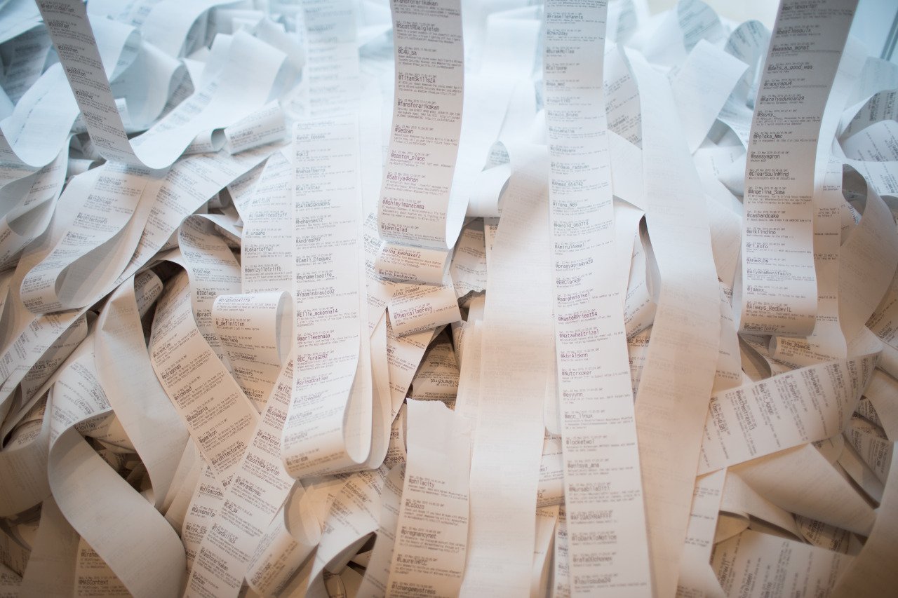

## Pure White

*Day 12*

The lighting, cleanness and spaces in Art Institute of Chicago make it amazingly beautiful. This museum fits perfectly into my dream museum where you can always take clean and beautiful photos in every different spot. I could feel they’ve designed this building into details with having a good sense of design in mind.

Originally, I thought “Art Institute of Chicago” should be a college and won’t be able to be visited; however, it is actually a popular museum that every people can visit. I saw “A Sunday Afternoon on the Island” by La Grande Jatte, “the Old Guitarist” by Pablo Picasso, “Water Lily Pond” by Claude Monet, and so on. However, from my point of view, the most interesting one was located in the second floor. That was a row of old fashion printer keep printing out the latest Twitts. By using real physical objects with real actions, people can have better feelings of what we do every day or every minute online, virtually, which made us to rethink the so-called social network.

I went to Shedd Aquarium again, but failed again. There were still too many people, and I think I should better go after the national holidays. So, I went to Field Museum instead, which is a general museum and couldn’t mention it and Art Institute of Chicago in the same breath.

---

*Art Institute of Chicago @ Chicago. May 25, 2015*
