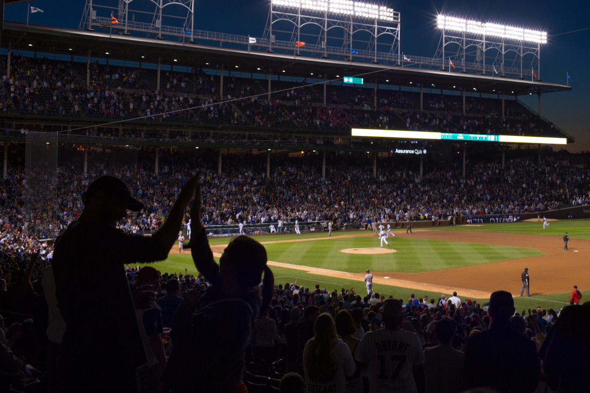

## Baseball Game Experience

*Day 14*

Baseball may be the only sport I’ve been watching since I was little. Though I don’t follow any team, I have been playing it with friends, and even had token classes in my college. Lots of Taiwanese people are crazy about baseball, and I am no exception. So, after visiting Shedd Aquarium and Museum of Contemporary Art, I went on a game in the evening, which was Chicago Cubs v.s. Washington Nationals.

I had a really nice experience, I booked the tickets few days ago on StubHub, and added the ticket onto my Passbook app on my phone. Therefore, when I arrived the field, my phone popped up a notification showing the ticket. The only thing I have to do is to show the phone, and they scanned the bar code on it. That’s it!

The game was fun, the first batter of Cubs hit a home run, which was a good start. Then, it was tie until the last inning, when Cubs gave out a walk-off hit to win the game. People all stood up and cheered for Cubs in the final part of the game, then sang their songs together when Cubs won. You can see from the photo, people were all standing and that two guys were giving high fives to celebrate the victory.

When I left the field, bars started to play loud music, and people were yelling happily. It may be hard for me to understand why Americans are that crazy about the sport, but I enjoyed the game and glad to be a part of them.

---

*Wrigley Field @ Chicago. May 27, 2015*
