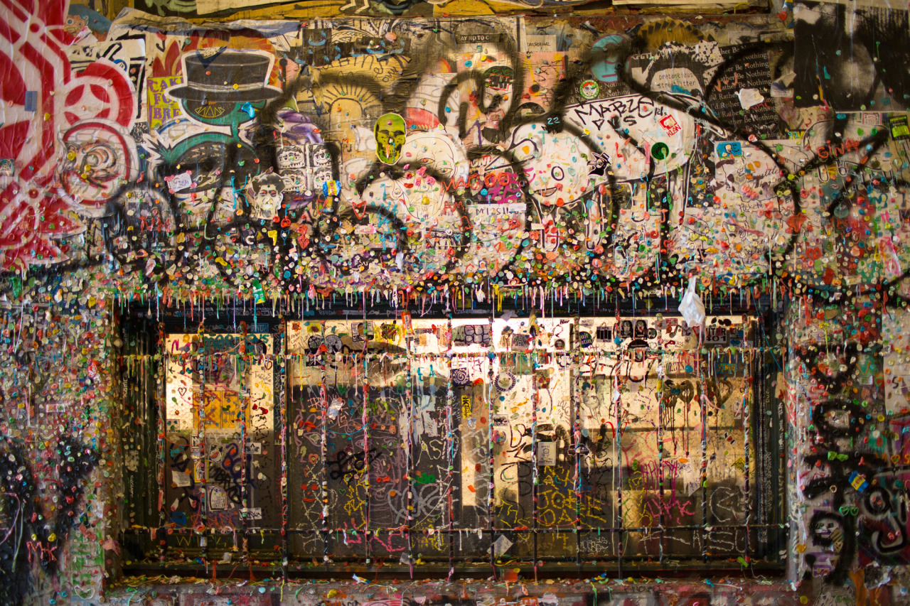

## Finally Brighter

*Day 15*

By waking up around 7 in the morning, I would have enough time to prepare for the flight to Seattle. However, it wasn’t a good flight experience, the airline didn’t give me a seat on the boarding ticket, then I have to talk to the staff at the gate directly. And, it turned out that they didn’t have enough seat, and have to make announcement to see if there’s anyone would like to later flights by offering some money back.

Seattle was totally a different city from Chicago, where is brighter and cleaner. I found people are more happy here, which may because that people I met are on vocations. I have two roommates, one is from Virginia, another is from Puerto Rico, and they are both here for traveling. Comparing to roommates in Chicago, who were staying for work, people here have less stress and talk about what places to go.

My place is close to Pike Market Place, which is a nice place to walk around and buy some food or artistic stuffs. The original Starbucks is also here! That’s the first Starbuck opened in 1921, where they still keep the old Starbucks sign, and sell exactly the same products as other Starbucks. Next to the market, there’s a place called “Gum Wall”. The walls on both sides are sticked with bubblegum. Of course it’s disgusting, but also colorful and artistic.

---

*Gum Wall @ Seattle. May 27, 2015*
