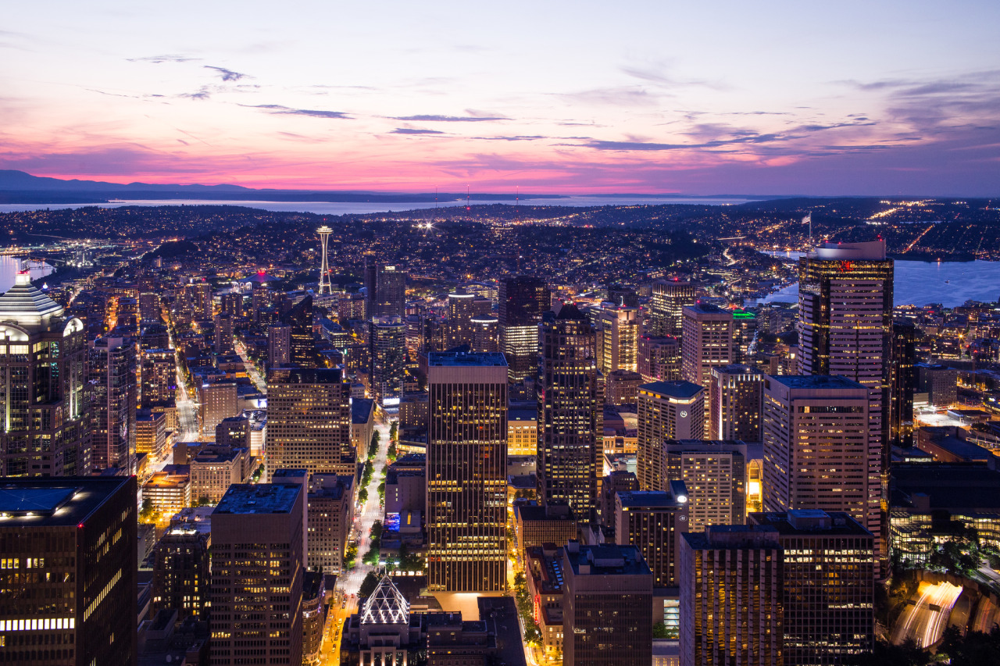

## No Need for a Plan

*Day 16*

> "Hi, I'm visiting. Do you know if there's any place I can go?"
>
> "Well, you can go down this road, and they are sailing boats. It should be lots of things to see there."
>
> "I see. Are you from here?"
>
> "Ya, how about you?"
>
> "Taiwan."
>
> "Formosa!"

As usual, I didn't plan until the day actually started, which pushed me to have a very casual day visiting the city following my heart. To start my day, I took a bus to Washington University, and asked a man with a camera to see what place I can visit. By following his words, I found a relaxing spot to watch people sailing the boats, or lying on the ground enjoying the sun shine. Washington University also got a big campus with a big football stadium, and I also checked out their Computer Science building, which turned out to be listed on my dream school list. It's not only due to its campus, but also because it's located in a lovely city, Seattle.

> "I would like to see the night view."
>
> "Sure. I will stamp on your hand, and feel free to come back in the night."

Then, I walked around the downtown where I encountered Sky View Observatory, a place located in the tallest building in Seattle. Since I didn't plan but prefer night view instead of day view, so I asked the door guard to know if I can come back in the night. Hopefully, I got nice shots in the end.

> "How was your day?" I asked my roommate from Puerto Rico when I was back in the night.
>
> "It was amazing! I went to the flight museum, where you can see how they assemble airplanes. Also, there's a free city tour, and you should definitely check it out."

Consequently, I have more ideas for my following days. As usual, I don't plan, but I always know where the way is.

---

*Sky View Observatory @ Seattle. May 28, 2015*
