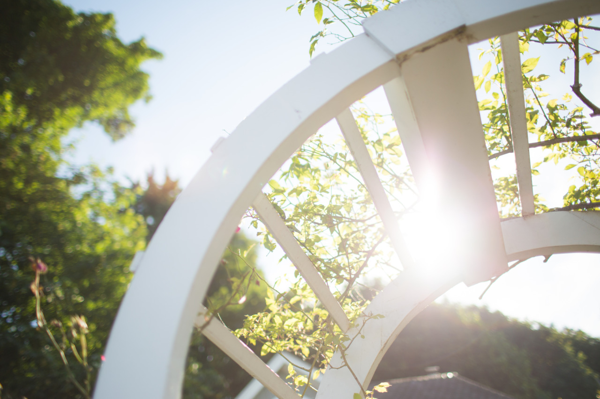

## Photography Starts Stories

*Day 17*

> "Is this Canon 600D?" When I saw her bringing a camera, I asked.
>
> "Yes!"
>
> "Where are you from?"

This was how our conversation began with the girl, Sammi, who sat besides me for the breakfast. Actually, I didn't plan to do anything today, but staying in a cafe instead to get some works done. However, plan changed. I joined a city tour and hanged out with Sammi to start my day.

The city tour took us around Pike Market Place, Gum Wall, Seattle Public Library, then ended at Seattle Ferries. We went to an oyster restaurant for a dozen of oysters, which were fresh and famous here. Thereafter, we visited Chinatown for some Cantonese food, then we took water taxi to Vashon, where we took lots of photos.

Photography is always a nice start for conversations since most of us love good photos; therefore people usually enjoy the process of creating good photos. Luckily, I like to take photos, and Sammi likes to be in the photo, which made us have lots of fun today. However, it was barely a short meet with her. I went for a baseball later on, and she got her interview to finish. When people went on different journeys, those photos remain meaningful and unforgettable.

---

*Vashon Island @ Seattle. May 29, 2015*
