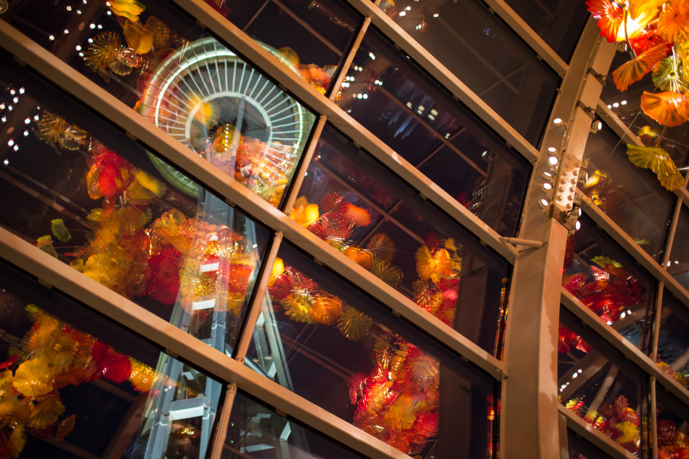

## Light in the Night

*Day 18*

"Peace is Possible" an old man pointing to the book title to Olive and me after he tossed few coins into the water. There is no doubt that this action nicely illustrate the image of Seattle, where strangers are friendly and interesting to interact with. Last day, when Sammi and I walked on the street, there was a homeless person following us for a long distance asking for the money. There was a lady who walked by and yelled at him, "Stop irritating people!"

Olive, my friend from CMU, drove to Seattle from Portland and joined my journey last day. We had been to a baseball game with firework last night, which was her first time to watch a baseball game and also a great start of the days hanging out with Olive! She drove, so we are now able to go more places as we want.

In the morning, we first visit Pike Market Place, then tried out Japanese Roll in a restaurant nearby. Next, we went to Discovery Park for a relaxing walk, which was a place with trees and seascape. Later on, we went for oysters again! Though Olive was from Hong Kong, but she enjoys Taiwanese food a lot, then we had dinner at Boil Point, where sells Taiwanese hot pot. I couldn't have that wonderful food without her taking me there.

In the night, we went to Chihuly Garden and Glass to see those glass arts. The light from huge glasses hung on the ceiling made the place bright and beautiful, leading to this place became my favorite part in Seattle. Olive and I sat under the giant glass art for a really long time to wait the sky turned dark so we could see how pretty it is in the night.

"I am really happy today" Olive told me, and, yes, I was really happy as well. Really.

---

*Chihuly Garden and Glass @ Seattle. May 30, 2015*
