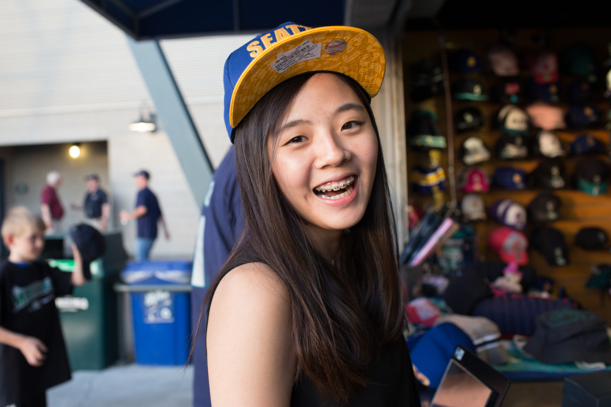

## Olive

*Day 19*

> "No one actually walked away from your life even though they couldn't stay with you anymore in the end. It's because all people you met and all the stories you had become part of you, and they made yourself a better person." Olive told me this and that really touched me.

After having a decent brunch, Olive and I went to Boeing Museum to see how they build airplanes, then we enjoy relaxing time walking among Green Lake. In the evening, we went to a cafe then drove to Din Tia Fund for delicious Taiwanese food. She even let me drive for a while with trust in me.

During the trip, besides listening to lots of Mandarin pop songs, we chatted a lot. We talked about the places we had been to, friends, family, and almost every interesting things. Sometime, I made up some jokes saying there's a ghost standing behind which drove her crazy. I appreciate that I can meet her here, and we had a really happy journey.

In the evening, I jogged among the river, I understood her words.

---

*Safeco Field @ Seattle. May 31, 2015*
