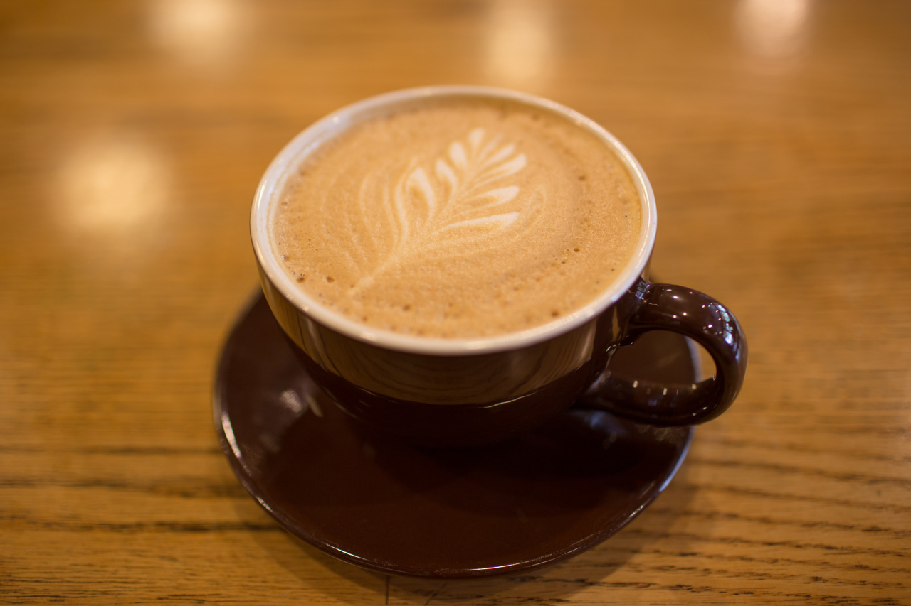

## Time to Think

*Day 20*

Whenever I am staying in a place for a long time, I find out a cafe to go regularly. It’s not about how much I like coffee, it’s about a place for me to calm down and think. Living in a hustle and bustle city, there’s always too many things come into our mind everyday, if we don’t think and absorb all these informations, we will learn nothing in the end.

“Starbucks represents something beyond a cup of coffee.” said by Howard D. Schultz, CEO and chairman of Starbucks. I believe he’s totally right, Starbucks is not only selling coffee, but a space for people to relax and get refreshed. Walking in Seattle, where is the birthplace of Starbucks, I can see coffee everywhere, and people enjoy their days instead of rushing around.

I stayed in two cafes today, and it’s not barely because of drinking coffee.

---

*Seattle Coffee Works @ Seattle. June 1, 2015*
